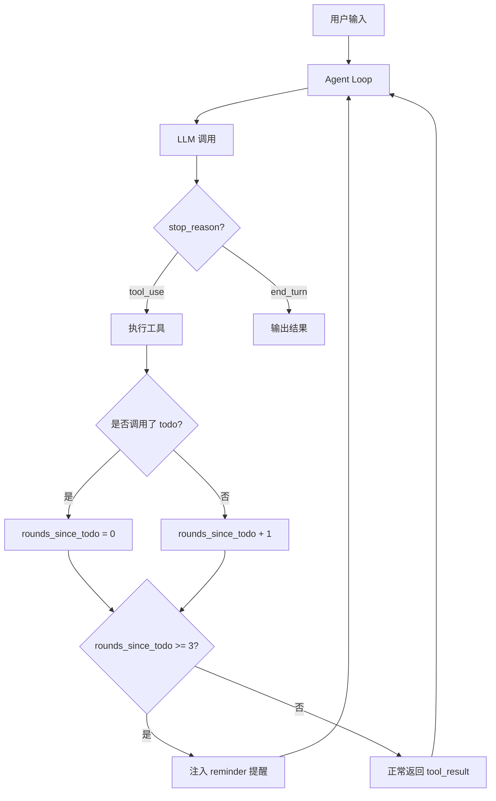

[任务规划]
好的，我来详细解释 [s03_todo_write.py](/Users/ziwh666/draft/2026/learn-claude-code/agents/s03_todo_write.py) 的实现。这个文件在 s02 的基础上增加了 **TodoManager 规划机制**，让 Agent 能够自我追踪多步任务的进度。

---

## 整体架构



---

## 逐块详解

### 1. 初始化部分（第33-46行）

```python
from anthropic import Anthropic
from dotenv import load_dotenv

load_dotenv(override=True)

if os.getenv("ANTHROPIC_BASE_URL"):
    os.environ.pop("ANTHROPIC_AUTH_TOKEN", None)

WORKDIR = Path.cwd()
client = Anthropic(base_url=os.getenv("ANTHROPIC_BASE_URL"))
MODEL = os.environ["MODEL_ID"]
```

这部分和 s01/s02 一样：加载 `.env`，初始化 Anthropic 客户端。`WORKDIR` 是当前工作目录，后续所有文件操作都限制在这个目录下。

### 2. System Prompt（第48-50行）

```python
SYSTEM = f"""You are a coding agent at {WORKDIR}.
Use the todo tool to plan multi-step tasks. Mark in_progress before starting, completed when done.
Prefer tools over prose."""
```

关键指令：**告诉模型使用 todo 工具来规划多步任务**，开始做之前标记 `in_progress`，做完标记 `completed`。这是"引导"而非"强制"——模型可以选择不用，但后面有 nag 机制来"催促"。

### 3. TodoManager 核心类（第54-88行）

这是 s03 的**核心新增**，一个结构化的任务状态管理器：

```python
class TodoManager:
    def __init__(self):
        self.items = []
```

内部维护一个 `items` 列表，每个 item 是 `{"id": "1", "text": "任务描述", "status": "pending"}` 的字典。

#### `update()` 方法 —— 写入/更新任务列表

```python
def update(self, items: list) -> str:
    if len(items) > 20:
        raise ValueError("Max 20 todos allowed")
```

**防护措施**：最多 20 个任务，防止模型生成过多无意义的任务。

```python
    validated = []
    in_progress_count = 0
    for i, item in enumerate(items):
        text = str(item.get("text", "")).strip()
        status = str(item.get("status", "pending")).lower()
        item_id = str(item.get("id", str(i + 1)))
        if not text:
            raise ValueError(f"Item {item_id}: text required")
        if status not in ("pending", "in_progress", "completed"):
            raise ValueError(f"Item {item_id}: invalid status '{status}'")
        if status == "in_progress":
            in_progress_count += 1
        validated.append({"id": item_id, "text": text, "status": status})
```

逐项验证：
- `text` 不能为空
- `status` 只能是三种状态之一：`pending`（待做）、`in_progress`（进行中）、`completed`（已完成）
- 统计 `in_progress` 的数量

```python
    if in_progress_count > 1:
        raise ValueError("Only one task can be in_progress at a time")
    self.items = validated
    return self.render()
```

**核心约束：同一时间只允许一个任务处于 `in_progress` 状态**。这是一个非常巧妙的设计——强制模型**顺序聚焦**，不能同时做多件事。验证通过后替换整个列表并返回渲染结果。

> 注意：每次调用 `update()` 都是**全量替换**，不是增量更新。模型每次都要传入完整的任务列表。

#### `render()` 方法 —— 渲染任务列表为文本

```python
def render(self) -> str:
    if not self.items:
        return "No todos."
    lines = []
    for item in self.items:
        marker = {"pending": "[ ]", "in_progress": "[>]", "completed": "[x]"}[item["status"]]
        lines.append(f"{marker} #{item['id']}: {item['text']}")
    done = sum(1 for t in self.items if t["status"] == "completed")
    lines.append(f"\n({done}/{len(self.items)} completed)")
    return "\n".join(lines)
```

渲染成人类可读的格式，例如：

```
[x] #1: Add type hints to hello.py
[>] #2: Add docstrings to hello.py
[ ] #3: Add main guard to hello.py

(1/3 completed)
```

这个文本会作为 `tool_result` 返回给模型，让模型在下一轮对话中"看到"当前进度。

### 4. 工具实现（第93-138行）

和 s02 基本一样的 4 个基础工具（`bash`、`read_file`、`write_file`、`edit_file`），加上新增的 `todo` 工具：

```python
TOOL_HANDLERS = {
    "bash":       lambda **kw: run_bash(kw["command"]),
    "read_file":  lambda **kw: run_read(kw["path"], kw.get("limit")),
    "write_file": lambda **kw: run_write(kw["path"], kw["content"]),
    "edit_file":  lambda **kw: run_edit(kw["path"], kw["old_text"], kw["new_text"]),
    "todo":       lambda **kw: TODO.update(kw["items"]),  # 新增
}
```

`todo` 工具的 schema 定义（第155-160行）：

```python
{"name": "todo", "description": "Update task list. Track progress on multi-step tasks.",
 "input_schema": {"type": "object", "properties": {"items": {"type": "array", "items": {"type": "object", "properties": {
     "id": {"type": "string"}, 
     "text": {"type": "string"}, 
     "status": {"type": "string", "enum": ["pending", "in_progress", "completed"]}
 }, "required": ["id", "text", "status"]}}}, "required": ["items"]}}
```

接收一个 `items` 数组，每个 item 必须有 `id`、`text`、`status` 三个字段。

### 5. Agent Loop —— 带 Nag Reminder 的核心循环（第164-193行）

这是 s03 相比 s02 **最重要的变化**：

```python
def agent_loop(messages: list):
    rounds_since_todo = 0  # 距离上次调用 todo 工具的轮数
```

新增一个计数器，追踪模型已经多少轮没有更新 todo 了。

```python
    while True:
        response = client.messages.create(
            model=MODEL, system=SYSTEM, messages=messages,
            tools=TOOLS, max_tokens=8000,
        )
        messages.append({"role": "assistant", "content": response.content})
        if response.stop_reason != "tool_use":
            return  # 模型不再调用工具，结束循环
```

标准的 agent loop：调用 LLM → 追加 assistant 消息 → 如果不是工具调用就结束。

```python
        results = []
        used_todo = False
        for block in response.content:
            if block.type == "tool_use":
                handler = TOOL_HANDLERS.get(block.name)
                try:
                    output = handler(**block.input) if handler else f"Unknown tool: {block.name}"
                except Exception as e:
                    output = f"Error: {e}"
                print(f"> {block.name}: {str(output)[:200]}")
                results.append({"type": "tool_result", "tool_use_id": block.id, "content": str(output)})
                if block.name == "todo":
                    used_todo = True  # 标记本轮使用了 todo
```

遍历所有工具调用，执行并收集结果。同时检测本轮是否调用了 `todo` 工具。

```python
        rounds_since_todo = 0 if used_todo else rounds_since_todo + 1
```

如果本轮用了 todo，计数器归零；否则 +1。

```python
        if rounds_since_todo >= 3:
            results.insert(0, {"type": "text", "text": "<reminder>Update your todos.</reminder>"})
```

**Nag Reminder 机制**：如果模型连续 **3 轮以上**没有调用 `todo` 工具，就在 `tool_result` 的**最前面**插入一条提醒文本 `<reminder>Update your todos.</reminder>`。

这条提醒会作为 `user` 消息的一部分发送给模型，制造一种"问责压力"——你不更新计划，系统就追着你问。

```python
        messages.append({"role": "user", "content": results})
```

将所有工具结果（可能包含 reminder）作为 user 消息追加到对话历史中。

### 6. 主循环（第196-211行）

```python
if __name__ == "__main__":
    history = []
    while True:
        try:
            query = input("\033[36ms03 >> \033[0m")
        except (EOFError, KeyboardInterrupt):
            break
        if query.strip().lower() in ("q", "exit", ""):
            break
        history.append({"role": "user", "content": query})
        agent_loop(history)
        # 打印最后一条 assistant 消息中的文本
        response_content = history[-1]["content"]
        if isinstance(response_content, list):
            for block in response_content:
                if hasattr(block, "text"):
                    print(block.text)
        print()
```

标准的 REPL 交互循环，和 s01/s02 类似。

---

## 设计精髓总结

| 设计点 | 作用 |
|---|---|
| **全量替换** `update()` | 模型每次都要传完整列表，强制它"回顾"所有任务 |
| **单 in_progress 约束** | 强制顺序执行，防止模型"多线程"跑偏 |
| **Nag Reminder** | 3 轮不更新就催促，防止模型"忘记"计划 |
| **渲染为文本返回** | 让模型在上下文中"看到"进度，弥补长对话中注意力衰减 |

这个设计体现了文档中说的 **Harness 层的规划理念**：

> *让模型不偏航，但不替它画航线。*

系统不会告诉模型"你应该分几步做"，而是提供一个工具让模型**自己规划**，然后通过约束（单 in_progress）和催促（nag reminder）来确保模型**按计划执行**。