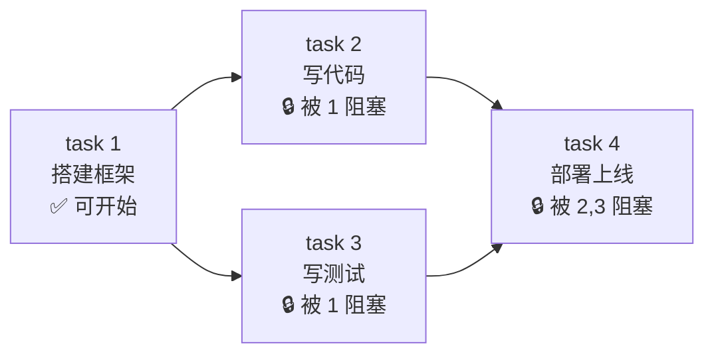
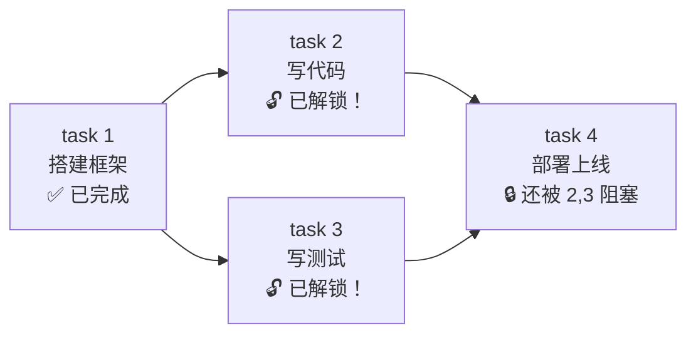
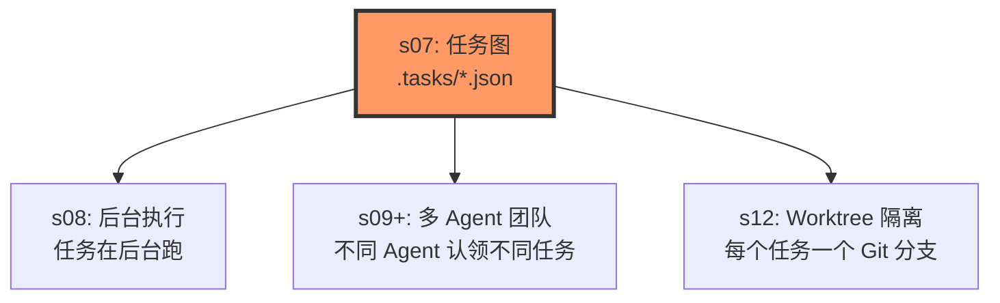

[任务规划]
让我先读取 s07 的源代码文件，结合文档给出详细解释。
[读取文件]
好的，两份源代码都已获取。下面结合文档和代码进行详细解释。

---

# s07: Task System 任务系统 —— 详细解释与具体示例

## 一、要解决什么问题？

回顾之前的演进：

| 版本 | 任务管理方式 | 问题 |
|---|---|---|
| s03 | 内存中的扁平 TodoList | 没有顺序、没有依赖、只有"做完/没做完" |
| s06 | 加了上下文压缩 | 压缩一跑，内存中的 Todo 就**全丢了** |

现实中的任务是有**结构**的。比如你要做一个项目：

```
1. 搭建项目框架        ← 必须先做
2. 写业务代码          ← 依赖 1
3. 写单元测试          ← 依赖 2
4. 部署上线            ← 依赖 2 和 3 都完成
```

s03 的扁平清单无法表达"任务 B 依赖任务 A"这种关系，Agent 分不清**什么能做、什么被卡住、什么能并行**。而且一旦 s06 的上下文压缩触发，内存中的清单直接消失。

**s07 的解决方案**：把扁平清单升级为**持久化到磁盘的任务图（DAG）**。

---

## 二、核心设计：文件持久化的任务图

### 存储结构

每个任务是一个独立的 JSON 文件，存放在 `.tasks/` 目录下：

```
.tasks/
├── task_1.json    ← 每个任务一个文件
├── task_2.json
├── task_3.json
└── task_4.json
```

每个 JSON 文件的结构：

```json
{
  "id": 1,
  "subject": "搭建项目框架",
  "description": "初始化项目结构，配置依赖",
  "status": "pending",          // pending → in_progress → completed
  "blockedBy": [],              // 我被谁阻塞（前置依赖）
  "blocks": [2, 3],            // 我阻塞了谁（后置依赖）
  "owner": ""                   // 任务负责人（为多 agent 预留）
}
```

### 为什么用文件而不是内存？

这是 s07 最关键的设计决策：

```
内存中的数据：
  对话历史 → s06 压缩后 → 💨 没了

磁盘上的文件：
  .tasks/task_1.json → s06 压缩后 → 📁 还在！
                     → 程序重启后 → 📁 还在！
                     → 换个 Agent 来 → 📁 还在！
```

> **核心洞察**：状态放在对话之外，就能活过压缩。

---

## 三、TaskManager 类逐方法详解

### 3.1 初始化与基础 CRUD

```python
class TaskManager:
    def __init__(self, tasks_dir: Path):
        self.dir = tasks_dir
        self.dir.mkdir(exist_ok=True)       # 确保 .tasks/ 目录存在
        self._next_id = self._max_id() + 1  # 从已有文件推算下一个 ID

    def _max_id(self) -> int:
        # 扫描 .tasks/ 下所有 task_*.json，提取最大 ID
        ids = [int(f.stem.split("_")[1]) for f in self.dir.glob("task_*.json")]
        return max(ids) if ids else 0
```

**为什么要从文件推算 ID？** 因为程序可能重启过。上次创建了 task_1 到 task_5，重启后 `_next_id` 应该从 6 开始，而不是从 1 重新来。

#### 具体示例 — 创建任务

```python
def create(self, subject: str, description: str = "") -> str:
    task = {
        "id": self._next_id, "subject": subject, "description": description,
        "status": "pending", "blockedBy": [], "blocks": [], "owner": "",
    }
    self._save(task)          # 写入 .tasks/task_N.json
    self._next_id += 1
    return json.dumps(task, indent=2)
```

当 Agent 调用 `task_create(subject="搭建项目框架")` 时：

1. 创建 task 字典，id=1，status="pending"
2. 写入 `.tasks/task_1.json`
3. `_next_id` 变为 2
4. 返回 JSON 字符串给 Agent

磁盘上生成的文件：
```json
// .tasks/task_1.json
{
  "id": 1,
  "subject": "搭建项目框架",
  "description": "",
  "status": "pending",
  "blockedBy": [],
  "blocks": [],
  "owner": ""
}
```

---

### 3.2 依赖关系管理（核心机制）

这是 s07 最重要的部分。`update` 方法处理两件事：**状态变更** 和 **依赖关联**。

```python
def update(self, task_id: int, status: str = None,
           add_blocked_by: list = None, add_blocks: list = None) -> str:
    task = self._load(task_id)
    
    # 1. 状态变更
    if status:
        if status not in ("pending", "in_progress", "completed"):
            raise ValueError(f"Invalid status: {status}")
        task["status"] = status
        # 关键：完成时自动解锁后续任务
        if status == "completed":
            self._clear_dependency(task_id)
    
    # 2. 添加"我被谁阻塞"
    if add_blocked_by:
        task["blockedBy"] = list(set(task["blockedBy"] + add_blocked_by))
    
    # 3. 添加"我阻塞了谁"（双向更新）
    if add_blocks:
        task["blocks"] = list(set(task["blocks"] + add_blocks))
        # 同时更新被阻塞任务的 blockedBy 列表
        for blocked_id in add_blocks:
            try:
                blocked = self._load(blocked_id)
                if task_id not in blocked["blockedBy"]:
                    blocked["blockedBy"].append(task_id)
                    self._save(blocked)
            except ValueError:
                pass
    
    self._save(task)
    return json.dumps(task, indent=2)
```

#### 具体示例 — 建立依赖关系

假设我们要建立这样的依赖图：

```
task 1 (搭建框架) → task 2 (写代码) → task 4 (部署)
task 1 (搭建框架) → task 3 (写测试) → task 4 (部署)
```

**步骤 1**：创建 4 个任务

```python
TASKS.create("搭建项目框架")    # task_1
TASKS.create("写业务代码")      # task_2
TASKS.create("写单元测试")      # task_3
TASKS.create("部署上线")        # task_4
```

此时 4 个任务都是 `pending`，没有任何依赖关系。

**步骤 2**：用 `add_blocks` 建立依赖

```python
# task 1 阻塞 task 2 和 task 3
TASKS.update(task_id=1, add_blocks=[2, 3])
```

这一步做了什么？看代码中的双向更新逻辑：

```
task_1.json: blocks = [2, 3]        ← 我阻塞了 2 和 3
task_2.json: blockedBy = [1]        ← 我被 1 阻塞（自动更新）
task_3.json: blockedBy = [1]        ← 我被 1 阻塞（自动更新）
```

```python
# task 2 和 task 3 都阻塞 task 4
TASKS.update(task_id=2, add_blocks=[4])
TASKS.update(task_id=3, add_blocks=[4])
```

最终状态：

```
task_1.json: blocks=[2,3],    blockedBy=[]     ← 可以立即开始
task_2.json: blocks=[4],      blockedBy=[1]    ← 被 task 1 阻塞
task_3.json: blocks=[4],      blockedBy=[1]    ← 被 task 1 阻塞
task_4.json: blocks=[],       blockedBy=[2,3]  ← 被 task 2 和 3 阻塞
```

用图表示：



---

### 3.3 依赖解除（自动解锁）

当一个任务完成时，`_clear_dependency` 会自动把它从所有其他任务的 `blockedBy` 中移除：

```python
def _clear_dependency(self, completed_id: int):
    """Remove completed_id from all other tasks' blockedBy lists."""
    for f in self.dir.glob("task_*.json"):
        task = json.loads(f.read_text())
        if completed_id in task.get("blockedBy", []):
            task["blockedBy"].remove(completed_id)
            self._save(task)
```

#### 具体示例 — 完成任务后的连锁解锁

**完成 task 1**：

```python
TASKS.update(task_id=1, status="completed")
```

执行过程：
1. `task_1.status` 设为 `"completed"`
2. `_clear_dependency(1)` 被调用
3. 扫描所有任务文件，发现 task_2 和 task_3 的 `blockedBy` 包含 `1`
4. 从 task_2 和 task_3 的 `blockedBy` 中移除 `1`

**变化前后对比**：

```
                    完成 task 1 之前              完成 task 1 之后
task_1.json:    status="pending"             status="completed" ✅
task_2.json:    blockedBy=[1]  🔒            blockedBy=[]  🔓 解锁了！
task_3.json:    blockedBy=[1]  🔒            blockedBy=[]  🔓 解锁了！
task_4.json:    blockedBy=[2,3] 🔒           blockedBy=[2,3] 🔒 还没解锁
```



现在 task 2 和 task 3 可以**并行执行**了！

**继续完成 task 2**：

```python
TASKS.update(task_id=2, status="completed")
```

```
task_4.json:    blockedBy=[2,3]  →  blockedBy=[3]    ← 只移除了 2，还被 3 阻塞
```

**继续完成 task 3**：

```python
TASKS.update(task_id=3, status="completed")
```

```
task_4.json:    blockedBy=[3]  →  blockedBy=[]    ← 3 也移除了，完全解锁！🔓
```

现在 task 4 终于可以开始了！

---

### 3.4 任务列表展示

```python
def list_all(self) -> str:
    tasks = []
    for f in sorted(self.dir.glob("task_*.json")):
        tasks.append(json.loads(f.read_text()))
    if not tasks:
        return "No tasks."
    lines = []
    for t in tasks:
        marker = {"pending": "[ ]", "in_progress": "[>]", "completed": "[x]"}.get(t["status"], "[?]")
        blocked = f" (blocked by: {t['blockedBy']})" if t.get("blockedBy") else ""
        lines.append(f"{marker} #{t['id']}: {t['subject']}{blocked}")
    return "\n".join(lines)
```

#### 具体示例 — 不同阶段的列表输出

**初始状态**（刚建立依赖后）：
```
[ ] #1: 搭建项目框架
[ ] #2: 写业务代码 (blocked by: [1])
[ ] #3: 写单元测试 (blocked by: [1])
[ ] #4: 部署上线 (blocked by: [2, 3])
```

**完成 task 1 后**：
```
[x] #1: 搭建项目框架
[ ] #2: 写业务代码                    ← 解锁了，没有 blocked by
[ ] #3: 写单元测试                    ← 解锁了
[ ] #4: 部署上线 (blocked by: [2, 3])
```

**task 2 进行中，task 3 完成后**：
```
[x] #1: 搭建项目框架
[>] #2: 写业务代码                    ← 进行中
[x] #3: 写单元测试                    ← 已完成
[ ] #4: 部署上线 (blocked by: [2])    ← 只剩 2 阻塞
```

**全部完成后**：
```
[x] #1: 搭建项目框架
[x] #2: 写业务代码
[x] #3: 写单元测试
[x] #4: 部署上线
```

---

## 四、双向依赖更新的设计细节

`add_blocks` 参数的处理是一个值得注意的设计：

```python
if add_blocks:
    task["blocks"] = list(set(task["blocks"] + add_blocks))
    # 双向更新：同时更新被阻塞任务的 blockedBy
    for blocked_id in add_blocks:
        try:
            blocked = self._load(blocked_id)
            if task_id not in blocked["blockedBy"]:
                blocked["blockedBy"].append(task_id)
                self._save(blocked)
        except ValueError:
            pass
```

**为什么要双向更新？** 因为依赖关系是双向的：

```
"task 1 阻塞 task 2"  等价于  "task 2 被 task 1 阻塞"
```

当你说 `update(task_id=1, add_blocks=[2])` 时，系统同时做两件事：
1. 在 task_1 的 `blocks` 中加入 `2` → "我阻塞了 2"
2. 在 task_2 的 `blockedBy` 中加入 `1` → "我被 1 阻塞"

这样无论你从哪个方向查询，信息都是一致的。

---

## 五、工具注册与 Agent 循环

### 4 个新工具

```python
TOOL_HANDLERS = {
    # ...基础工具（bash, read_file, write_file, edit_file）...
    "task_create": lambda **kw: TASKS.create(kw["subject"], kw.get("description", "")),
    "task_update": lambda **kw: TASKS.update(kw["task_id"], kw.get("status"), 
                                              kw.get("addBlockedBy"), kw.get("addBlocks")),
    "task_list":   lambda **kw: TASKS.list_all(),
    "task_get":    lambda **kw: TASKS.get(kw["task_id"]),
}
```

| 工具 | 作用 | 参数 |
|---|---|---|
| `task_create` | 创建新任务 | `subject`, `description`(可选) |
| `task_update` | 更新状态/依赖 | `task_id`, `status`, `addBlockedBy`, `addBlocks` |
| `task_list` | 列出所有任务 | 无 |
| `task_get` | 获取单个任务详情 | `task_id` |

### Agent 循环（对比 s06 简化了）

注意 s07 的 `agent_loop` 相比 s06 **去掉了上下文压缩**（micro_compact、auto_compact、compact 工具都没了），因为 s07 专注于演示任务系统本身：

```python
def agent_loop(messages: list):
    while True:
        response = client.messages.create(
            model=MODEL, system=SYSTEM, messages=messages,
            tools=TOOLS, max_tokens=8000,
        )
        messages.append({"role": "assistant", "content": response.content})
        if response.stop_reason != "tool_use":
            return
        results = []
        for block in response.content:
            if block.type == "tool_use":
                handler = TOOL_HANDLERS.get(block.name)
                try:
                    output = handler(**block.input) if handler else f"Unknown tool: {block.name}"
                except Exception as e:
                    output = f"Error: {e}"
                print(f"> {block.name}: {str(output)[:200]}")
                results.append({"type": "tool_result", "tool_use_id": block.id, "content": str(output)})
        messages.append({"role": "user", "content": results})
```

循环逻辑和之前一样：调用 LLM → 执行工具 → 把结果喂回去 → 继续循环。

---

## 六、完整交互示例

下面模拟一个真实的交互过程，展示 Agent 如何使用任务系统：

### 用户输入

```
s07 >> Create a task board for refactoring: parse -> transform -> emit -> test, 
       where transform and emit can run in parallel after parse
```

### Agent 的工具调用序列

**第 1 轮**：Agent 创建 4 个任务

```
> task_create: {"subject": "Parse - 解析源代码"}
  → task_1.json 创建

> task_create: {"subject": "Transform - 转换 AST"}
  → task_2.json 创建

> task_create: {"subject": "Emit - 生成目标代码"}
  → task_3.json 创建

> task_create: {"subject": "Test - 运行测试"}
  → task_4.json 创建
```

**第 2 轮**：Agent 建立依赖关系

```
> task_update: {"task_id": 1, "add_blocks": [2, 3]}
  → task_1.blocks = [2, 3]
  → task_2.blockedBy = [1]  (自动双向更新)
  → task_3.blockedBy = [1]  (自动双向更新)

> task_update: {"task_id": 2, "add_blocks": [4]}
  → task_2.blocks = [4]
  → task_4.blockedBy = [2]  (自动双向更新)

> task_update: {"task_id": 3, "add_blocks": [4]}
  → task_3.blocks = [4]
  → task_4.blockedBy = [2, 3]  (自动双向更新)
```

**第 3 轮**：Agent 调用 `task_list` 展示结果

```
> task_list:
  [ ] #1: Parse - 解析源代码
  [ ] #2: Transform - 转换 AST (blocked by: [1])
  [ ] #3: Emit - 生成目标代码 (blocked by: [1])
  [ ] #4: Test - 运行测试 (blocked by: [2, 3])
```

Agent 回复用户：

> 任务看板已创建！依赖关系如下：
> - Task 1 (Parse) 可以立即开始
> - Task 2 (Transform) 和 Task 3 (Emit) 等 Parse 完成后可以**并行执行**
> - Task 4 (Test) 需要等 Transform 和 Emit **都完成**后才能开始

### 后续操作 — 完成任务

```
s07 >> Complete task 1 and then list tasks
```

```
> task_update: {"task_id": 1, "status": "completed"}
  → task_1.status = "completed"
  → _clear_dependency(1): 从 task_2 和 task_3 的 blockedBy 中移除 1

> task_list:
  [x] #1: Parse - 解析源代码
  [ ] #2: Transform - 转换 AST          ← 解锁了！
  [ ] #3: Emit - 生成目标代码            ← 解锁了！
  [ ] #4: Test - 运行测试 (blocked by: [2, 3])
```

---

## 七、与 s06 的对比总结

| 维度 | s06 (上下文压缩) | s07 (任务系统) |
|---|---|---|
| **工具数量** | 5 个（bash, read/write/edit, compact） | 8 个（+task_create/update/list/get） |
| **规划模型** | 扁平清单（仅内存） | 带依赖关系的任务图（磁盘） |
| **关系表达** | 无 | `blockedBy` + `blocks` 双向边 |
| **状态粒度** | 做完/没做完 | `pending` → `in_progress` → `completed` |
| **持久化** | 压缩后丢失 | 压缩和重启后**存活** |
| **并行识别** | 不支持 | `blockedBy` 为空的任务可并行 |
| **上下文压缩** | 三层压缩 | 无（专注演示任务系统） |

---

## 八、为什么这很重要？

s07 的任务图是后续所有高级机制的**协调骨架**：



- **s08**：后台执行器读取任务图，找到 `blockedBy` 为空的任务去执行
- **s09+**：多个 Agent 通过 `owner` 字段认领任务，并行工作
- **s12**：每个任务对应一个 Git worktree，实现文件级别的隔离

任务图就像一个**共享的看板**，所有 Agent 都能读写它，知道该做什么、什么被卡住、什么能并行。这就是从"单个 Agent 的工具"到"多 Agent 协作系统"的关键一步。