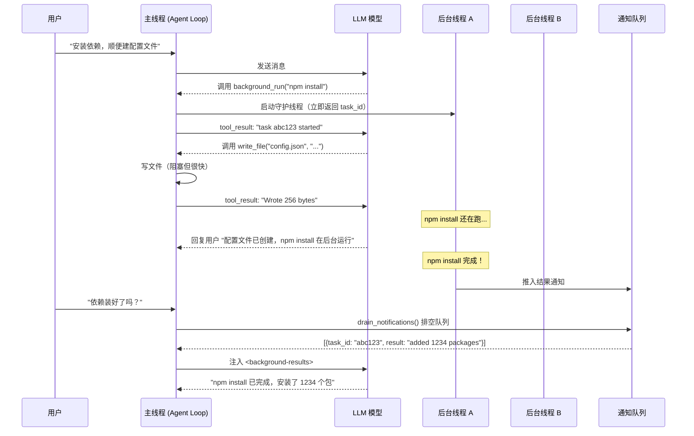

[任务规划]
[读取文件]
好的，源代码已完整获取。下面结合文档和代码进行详细解释。

---

# s08: Background Tasks 后台任务 —— 详细解释与具体示例

## 一、要解决什么问题？

在之前的所有版本中，Agent 执行命令都是**阻塞式**的：

```
用户: "安装依赖，顺便建个配置文件"

Agent 的实际执行（阻塞式）：
  ┌─────────────────────────────────────────────────────────┐
  │ bash("npm install")                                     │
  │ ⏳ 等待 3 分钟...                                       │
  │ ⏳ 什么都做不了...                                       │
  │ ⏳ 模型在干等...                                         │
  │ ✅ 安装完成                                              │
  │                                                         │
  │ write_file("config.json", "...")   ← 终于可以做第二件事  │
  └─────────────────────────────────────────────────────────┘
  总耗时: 3 分钟 + 几秒 ≈ 3 分钟
```

问题很明显：`npm install` 跑 3 分钟，Agent 只能**干等**，不能同时去做"建配置文件"这件事。

**理想情况应该是**：

```
Agent 的理想执行（非阻塞式）：
  ┌─────────────────────────────────────────────────────────┐
  │ background_run("npm install")  → 立即返回 task_id       │
  │ write_file("config.json", "...")  ← 马上做第二件事       │
  │ ... 继续做其他事 ...                                     │
  │                                                         │
  │ [npm install 在后台跑完了，结果自动注入]                  │
  └─────────────────────────────────────────────────────────┘
  总耗时: 3 分钟（但期间做了很多其他事）
```

---

## 二、整体架构



核心思想：**主线程永远不阻塞在长命令上，后台线程跑完后通过队列通知主线程。**

---

## 三、BackgroundManager 类逐方法详解

### 3.1 初始化

```python
class BackgroundManager:
    def __init__(self):
        self.tasks = {}                  # task_id -> {status, result, command}
        self._notification_queue = []    # 已完成任务的结果通知
        self._lock = threading.Lock()    # 线程锁，保护队列
```

三个核心数据结构：

| 属性 | 类型 | 作用 |
|---|---|---|
| `tasks` | `dict` | 所有任务的注册表，可以随时查询状态 |
| `_notification_queue` | `list` | 已完成任务的结果，等待被主线程消费 |
| `_lock` | `Lock` | 线程锁，因为后台线程和主线程会**同时访问**队列 |

### 3.2 run() — 启动后台任务

```python
def run(self, command: str) -> str:
    """Start a background thread, return task_id immediately."""
    task_id = str(uuid.uuid4())[:8]                                    # 1. 生成 8 位短 ID
    self.tasks[task_id] = {"status": "running", "result": None, "command": command}  # 2. 注册任务
    thread = threading.Thread(
        target=self._execute, args=(task_id, command), daemon=True     # 3. 创建守护线程
    )
    thread.start()                                                     # 4. 启动线程
    return f"Background task {task_id} started: {command[:80]}"        # 5. 立即返回
```

#### 具体示例

```python
BG.run("npm install")
# 返回: "Background task a1b2c3d4 started: npm install"
# 此时 npm install 已经在后台线程中开始执行
# 但 run() 方法已经返回了，不会等待 npm install 完成
```

**关键细节**：

- `daemon=True`：守护线程。意味着主程序退出时，后台线程会自动终止，不会阻止程序退出
- `uuid.uuid4()[:8]`：生成 8 位随机 ID，如 `"a1b2c3d4"`，用于后续查询和通知
- 函数**立即返回**，不等待命令执行完成

### 3.3 _execute() — 后台线程的执行体

```python
def _execute(self, task_id: str, command: str):
    """Thread target: run subprocess, capture output, push to queue."""
    try:
        r = subprocess.run(
            command, shell=True, cwd=WORKDIR,
            capture_output=True, text=True, timeout=300    # 超时 5 分钟
        )
        output = (r.stdout + r.stderr).strip()[:50000]
        status = "completed"
    except subprocess.TimeoutExpired:
        output = "Error: Timeout (300s)"
        status = "timeout"
    except Exception as e:
        output = f"Error: {e}"
        status = "error"
    
    # 更新任务状态
    self.tasks[task_id]["status"] = status
    self.tasks[task_id]["result"] = output or "(no output)"
    
    # 推入通知队列（需要加锁！）
    with self._lock:
        self._notification_queue.append({
            "task_id": task_id,
            "status": status,
            "command": command[:80],
            "result": (output or "(no output)")[:500],    # 通知中只保留前 500 字符
        })
```

#### 具体示例 — 执行过程

假设后台运行 `sleep 3 && echo "done"`：

```
时间线：
t=0s   _execute 开始，subprocess.run 启动子进程
t=0s   子进程开始执行 "sleep 3 && echo done"
t=3s   子进程完成，stdout = "done"
t=3s   self.tasks["a1b2c3d4"] = {status: "completed", result: "done", ...}
t=3s   self._notification_queue.append({task_id: "a1b2c3d4", result: "done", ...})
```

**为什么通知中的 result 只保留 500 字符？**

通知会被注入到对话历史中，如果一个 `pytest` 输出了 10000 行日志，全部注入会浪费大量 token。500 字符足够 Agent 判断"成功还是失败"。如果需要完整输出，Agent 可以用 `check_background` 工具查看（完整结果存在 `self.tasks` 中）。

### 3.4 drain_notifications() — 排空通知队列

```python
def drain_notifications(self) -> list:
    """Return and clear all pending completion notifications."""
    with self._lock:
        notifs = list(self._notification_queue)    # 复制一份
        self._notification_queue.clear()           # 清空原队列
    return notifs
```

这是一个经典的**生产者-消费者**模式：

```
后台线程（生产者）                    主线程（消费者）
    │                                    │
    ├── 任务 A 完成 → 推入队列            │
    ├── 任务 B 完成 → 推入队列            │
    │                                    ├── drain_notifications()
    │                                    │   → 取出 [A结果, B结果]
    │                                    │   → 队列清空
    │                                    │
    ├── 任务 C 完成 → 推入队列            │
    │                                    ├── drain_notifications()
    │                                    │   → 取出 [C结果]
```

**为什么要加锁（`self._lock`）？**

因为后台线程可能在**任何时刻**往队列里推数据，而主线程也在读队列。如果不加锁，可能出现：

```
后台线程正在 append → 主线程同时在 clear → 💥 数据竞争
```

`threading.Lock()` 确保同一时刻只有一个线程在操作队列。

### 3.5 check() — 查询任务状态

```python
def check(self, task_id: str = None) -> str:
    """Check status of one task or list all."""
    if task_id:
        t = self.tasks.get(task_id)
        if not t:
            return f"Error: Unknown task {task_id}"
        return f"[{t['status']}] {t['command'][:60]}\n{t.get('result') or '(running)'}"
    # 不传 task_id 则列出所有任务
    lines = []
    for tid, t in self.tasks.items():
        lines.append(f"{tid}: [{t['status']}] {t['command'][:60]}")
    return "\n".join(lines) if lines else "No background tasks."
```

#### 具体示例

```python
# 查询单个任务
BG.check("a1b2c3d4")
# → "[running] npm install\n(running)"          ← 还在跑
# → "[completed] npm install\nadded 1234 packages in 45s"  ← 跑完了

# 查询所有任务
BG.check()
# → "a1b2c3d4: [completed] npm install
#    e5f6g7h8: [running] pytest
#    i9j0k1l2: [error] docker build ."
```

---

## 四、Agent Loop 中的通知注入机制

这是 s08 相对之前版本最关键的变化：

```python
def agent_loop(messages: list):
    while True:
        # ★ 关键：每次调用 LLM 前，排空通知队列
        notifs = BG.drain_notifications()
        if notifs and messages:
            notif_text = "\n".join(
                f"[bg:{n['task_id']}] {n['status']}: {n['result']}" for n in notifs
            )
            # 注入为一对 user/assistant 消息
            messages.append({"role": "user", "content": 
                f"<background-results>\n{notif_text}\n</background-results>"})
            messages.append({"role": "assistant", "content": 
                "Noted background results."})
        
        response = client.messages.create(
            model=MODEL, system=SYSTEM, messages=messages,
            tools=TOOLS, max_tokens=8000,
        )
        # ... 后续正常的工具执行循环 ...
```

### 为什么注入为 user + assistant 一对消息？

这是 Anthropic API 的要求：消息必须是 `user` 和 `assistant` **交替出现**的。不能连续两条 `user` 消息。

```python
# ❌ 错误：连续两条 user 消息
messages = [
    {"role": "user", "content": "帮我安装依赖"},
    {"role": "assistant", "content": [tool_use: background_run("npm install")]},
    {"role": "user", "content": [tool_result: "task abc started"]},
    {"role": "assistant", "content": "好的，npm install 在后台运行"},
    {"role": "user", "content": "<background-results>...</background-results>"},  # ← user
    {"role": "user", "content": "依赖装好了吗？"},                                # ← 又是 user！❌
]

# ✅ 正确：插入一条 assistant 消息保持交替
messages = [
    ...
    {"role": "user", "content": "<background-results>...</background-results>"},
    {"role": "assistant", "content": "Noted background results."},  # ← 保持交替
    {"role": "user", "content": "依赖装好了吗？"},                   # ← 现在可以了 ✅
]
```

---

## 五、完整交互示例

### 示例 1：后台安装依赖，同时创建配置文件

```
s08 >> Run "sleep 5 && echo done" in the background, then create a file while it runs
```

**时间线详解**：

```
t=0s  用户输入
      ↓
      agent_loop 开始
      drain_notifications() → 空（没有后台任务）
      ↓
      调用 LLM
      ↓
t=1s  LLM 返回: 调用 background_run(command="sleep 5 && echo done")
      ↓
      BG.run("sleep 5 && echo done")
        → 启动后台线程
        → 立即返回 "Background task a1b2c3d4 started: sleep 5 && echo done"
      ↓
      tool_result 追加到 messages
      ↓
      继续循环 → drain_notifications() → 空（后台还在跑）
      ↓
      调用 LLM
      ↓
t=2s  LLM 返回: 调用 write_file(path="hello.txt", content="Hello World!")
      ↓
      run_write("hello.txt", "Hello World!")
        → 写入文件
        → 返回 "Wrote 12 bytes"
      ↓
      tool_result 追加到 messages
      ↓
      继续循环 → drain_notifications() → 空（后台还在跑）
      ↓
      调用 LLM
      ↓
t=3s  LLM 返回文本: "我已经在后台启动了 sleep 命令，同时创建了 hello.txt 文件。"
      stop_reason != "tool_use" → agent_loop 返回
      ↓
      打印回复给用户

      ====== 后台线程还在跑 ======

t=5s  后台线程: sleep 5 完成，echo done 输出 "done"
      → self.tasks["a1b2c3d4"] = {status: "completed", result: "done"}
      → self._notification_queue.append({task_id: "a1b2c3d4", result: "done"})

      ====== 用户再次输入 ======

t=10s 用户: "后台任务完成了吗？"
      ↓
      agent_loop 开始
      drain_notifications() → [{task_id: "a1b2c3d4", status: "completed", result: "done"}]
      ↓
      注入消息:
        user: "<background-results>\n[bg:a1b2c3d4] completed: done\n</background-results>"
        assistant: "Noted background results."
      ↓
      调用 LLM（LLM 看到了后台结果）
      ↓
      LLM 回复: "后台任务已完成！输出是 'done'。"
```

### 示例 2：同时启动 3 个后台任务

```
s08 >> Start 3 background tasks: "sleep 2", "sleep 4", "sleep 6". Check their status.
```

**Agent 的工具调用序列**：

```
第 1 轮 LLM 调用:
> background_run: command="sleep 2 && echo task1-done"
  → "Background task aaa11111 started"
> background_run: command="sleep 4 && echo task2-done"
  → "Background task bbb22222 started"
> background_run: command="sleep 6 && echo task3-done"
  → "Background task ccc33333 started"

第 2 轮 LLM 调用:
  drain_notifications() → 空（都还在跑）
> check_background: (无参数，列出所有)
  → "aaa11111: [running] sleep 2 && echo task1-done
     bbb22222: [running] sleep 4 && echo task2-done
     ccc33333: [running] sleep 6 && echo task3-done"

第 3 轮 LLM 调用:
  LLM 回复: "3 个后台任务都已启动，目前都在运行中。"
  → agent_loop 返回

====== 2 秒后 ======
通知队列: [{task_id: "aaa11111", result: "task1-done"}]

====== 4 秒后 ======
通知队列: [{task_id: "bbb22222", result: "task2-done"}]

====== 用户再次提问 ======
s08 >> How are the tasks doing?

  drain_notifications() → [aaa11111完成, bbb22222完成]  (假设此时已过 4 秒)
  注入:
    user: "<background-results>
           [bg:aaa11111] completed: task1-done
           [bg:bbb22222] completed: task2-done
           </background-results>"
    assistant: "Noted background results."

  LLM 回复: "任务 1 和 2 已完成，任务 3 还在运行。"

====== 6 秒后 ======
s08 >> And now?

  drain_notifications() → [ccc33333完成]
  注入:
    user: "<background-results>
           [bg:ccc33333] completed: task3-done
           </background-results>"

  LLM 回复: "所有 3 个任务都已完成！"
```

用时间线图表示：

```
时间:  0s    1s    2s    3s    4s    5s    6s    7s
       │     │     │     │     │     │     │     │
Task1: ├─────┤ done                               
Task2: ├───────────┤ done                          
Task3: ├─────────────────┤ done                    
       │     │     │     │     │     │     │     │
Agent: [启动3个]  [check]  [回复]        [查询]  [全部完成]
       └──────────────────┘              └──────┘
       第一次交互                         第二次交互
```

---

## 六、阻塞 bash vs 后台 background_run 对比

s08 同时保留了两种执行方式：

| 维度 | `bash`（阻塞） | `background_run`（后台） |
|---|---|---|
| **返回时机** | 命令执行完才返回 | 立即返回 task_id |
| **超时** | 120 秒 | 300 秒（长命令需要更多时间） |
| **结果获取** | 直接在返回值中 | 通过通知队列或 check 工具 |
| **适用场景** | 快速命令：`ls`, `cat`, `echo` | 慢命令：`npm install`, `pytest`, `docker build` |
| **并发** | 不支持 | 支持多个同时运行 |

Agent 可以根据命令的预期耗时**自主选择**用哪种方式。System prompt 中的提示 `"Use background_run for long-running commands"` 引导模型做出正确选择。

---

## 七、线程安全设计要点

### 为什么只有 `_notification_queue` 需要加锁？

```python
# 需要加锁 ✅
with self._lock:
    self._notification_queue.append(...)    # 后台线程写
    
with self._lock:
    notifs = list(self._notification_queue)  # 主线程读
    self._notification_queue.clear()
```

```python
# 不需要加锁 ❌（但其实有隐患）
self.tasks[task_id]["status"] = status      # 后台线程写
self.tasks.get(task_id)                     # 主线程读（check 工具）
```

严格来说 `self.tasks` 也应该加锁，但在 CPython 中，由于 GIL（全局解释器锁），简单的字典赋值操作是原子的，所以实际上不会出问题。这里为了代码简洁做了简化。

### 为什么用守护线程（daemon=True）？

```python
thread = threading.Thread(target=self._execute, ..., daemon=True)
```

守护线程的特点：**主线程退出时，守护线程自动终止**。

如果不设为守护线程，当用户按 `Ctrl+C` 退出程序时，程序会等待所有后台命令执行完才退出。如果有个 `sleep 300` 在跑，用户就要等 5 分钟才能退出程序。

---

## 八、与 s07 的对比总结

| 组件 | s07 (任务系统) | s08 (后台任务) |
|---|---|---|
| **工具数量** | 8 个（基础 + task_*） | 6 个（基础 + background_run + check） |
| **执行方式** | 仅阻塞 | 阻塞 + 后台线程 |
| **通知机制** | 无 | 每轮排空的通知队列 |
| **并发** | 无 | 守护线程并行执行 |
| **关注点** | 任务的**规划和依赖** | 任务的**执行效率** |

s07 解决的是"做什么、先做什么"（规划），s08 解决的是"怎么做得更快"（执行）。两者是互补的——在完整的 Agent 中，可以用 s07 的任务图规划工作，用 s08 的后台线程加速执行。

---

## 九、核心洞察

> **"Fire and forget — Agent 不会在命令运行时阻塞。"**

这个模式在真实的 AI 编码助手中非常常见。比如 Claude Code 在执行 `npm install` 时，不会傻等 3 分钟，而是会继续分析代码、写文件、做其他事情。后台任务完成后，结果会自动注入到上下文中，Agent 就知道"哦，依赖装好了"或者"测试跑失败了"。