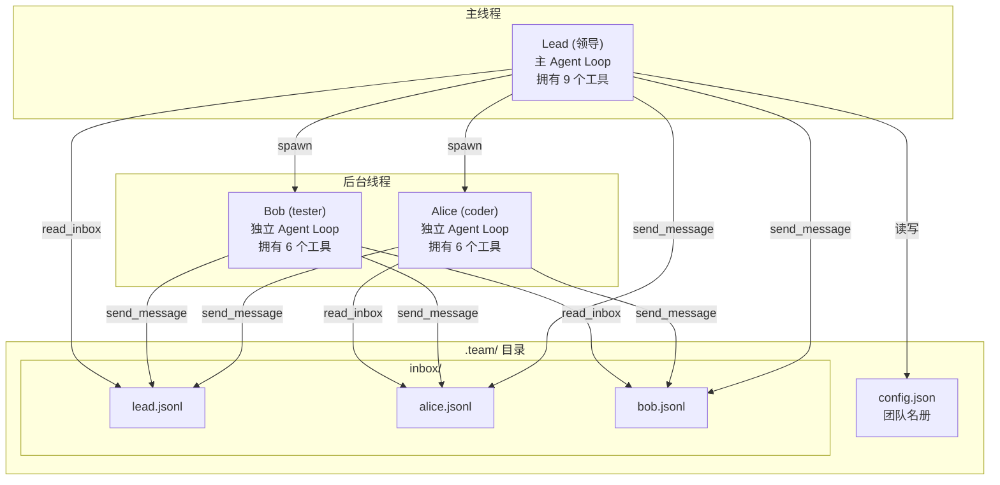
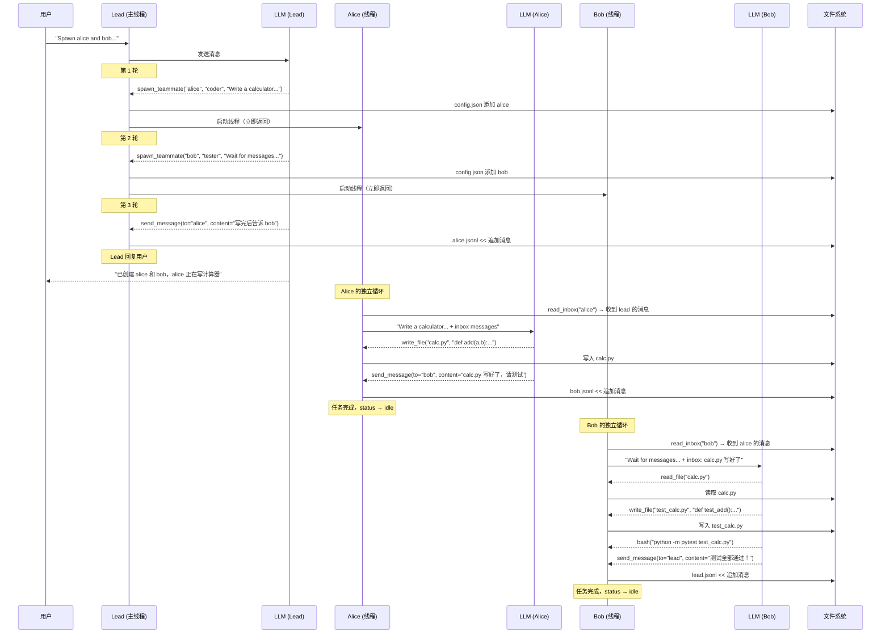

[任务规划]
[读取文件]
好的，源代码已完整获取。下面结合文档和代码进行详细解释。

---

# s09: Agent Teams 智能体团队 —— 详细解释与具体示例

## 一、要解决什么问题？

回顾之前版本中"多个 Agent 协作"的演进：

| 版本 | 方式 | 局限 |
|---|---|---|
| s04 子智能体 | 主 Agent 生成子 Agent → 子 Agent 干活 → 返回摘要 → **消亡** | 一次性的，没有身份，没有记忆 |
| s08 后台任务 | 后台线程跑 shell 命令 | 只能跑命令，不能做 LLM 引导的决策 |

**现实中的团队协作需要什么？**

想象一个软件开发团队：

```
项目经理（Lead）: "Alice 你写代码，Bob 你写测试"
Alice（Coder）:   写完代码后告诉 Bob "代码写好了，在 src/app.py"
Bob（Tester）:    收到消息后去写测试，发现 bug 告诉 Alice "第 42 行有 bug"
Alice:            收到消息后修 bug，修完告诉 Bob "修好了，再测一下"
```

这需要三样东西：

1. **持久身份** — Alice 和 Bob 不是用完就扔的，他们有名字、角色、状态
2. **生命周期** — 他们可以工作、空闲、再工作，不是一次性的
3. **通信通道** — 他们能互相发消息，而不是只能通过"领导"中转

**s09 的解决方案**：文件系统上的"团队邮箱"。

---

## 二、整体架构



核心思想：**每个队友是一个独立的 Agent Loop，运行在自己的线程中，通过文件系统上的 JSONL 邮箱互相通信。**

---

## 三、文件系统结构

```
.team/
├── config.json              ← 团队名册（谁在团队里，什么角色，什么状态）
└── inbox/
    ├── lead.jsonl           ← 领导的收件箱
    ├── alice.jsonl          ← Alice 的收件箱
    └── bob.jsonl            ← Bob 的收件箱
```

### config.json 示例

```json
{
  "team_name": "default",
  "members": [
    {"name": "alice", "role": "coder", "status": "working"},
    {"name": "bob", "role": "tester", "status": "idle"}
  ]
}
```

### JSONL 收件箱示例（alice.jsonl）

```jsonl
{"type": "message", "from": "lead", "content": "请写一个计算器模块", "timestamp": 1711500000.0}
{"type": "message", "from": "bob", "content": "第 42 行有 bug，除零没处理", "timestamp": 1711500120.0}
{"type": "broadcast", "from": "lead", "content": "大家注意：deadline 提前了", "timestamp": 1711500200.0}
```

**为什么用 JSONL 而不是 JSON？**

JSONL（每行一个 JSON 对象）有一个关键优势：**追加写入不需要读取整个文件**。

```python
# JSONL: 直接追加一行，O(1) 操作
with open("alice.jsonl", "a") as f:
    f.write(json.dumps(msg) + "\n")

# JSON: 需要读取 → 解析 → 修改 → 重写整个文件，O(n) 操作
data = json.loads(open("alice.json").read())
data.append(msg)
open("alice.json", "w").write(json.dumps(data))
```

多个线程同时往不同文件追加写入，互不干扰。

---

## 四、MessageBus 消息总线 —— 逐方法详解

### 4.1 send() — 发送消息

```python
def send(self, sender: str, to: str, content: str,
         msg_type: str = "message", extra: dict = None) -> str:
    if msg_type not in VALID_MSG_TYPES:
        return f"Error: Invalid type '{msg_type}'. Valid: {VALID_MSG_TYPES}"
    msg = {
        "type": msg_type,
        "from": sender,
        "content": content,
        "timestamp": time.time(),
    }
    if extra:
        msg.update(extra)
    inbox_path = self.dir / f"{to}.jsonl"
    with open(inbox_path, "a") as f:        # "a" = append 追加模式
        f.write(json.dumps(msg) + "\n")
    return f"Sent {msg_type} to {to}"
```

#### 具体示例

```python
BUS.send("lead", "alice", "请写一个计算器模块")
```

执行过程：
1. 构造消息：`{"type": "message", "from": "lead", "content": "请写一个计算器模块", "timestamp": 1711500000.0}`
2. 打开 `.team/inbox/alice.jsonl`，以追加模式写入
3. 文件中新增一行 JSON

**5 种消息类型**：

| 类型 | 用途 | 示例 |
|---|---|---|
| `message` | 普通消息 | "请写一个计算器模块" |
| `broadcast` | 广播给所有人 | "项目进入第二阶段" |
| `shutdown_request` | 请求关闭（s10 用） | "你可以下班了" |
| `shutdown_response` | 关闭确认（s10 用） | "好的，我已保存工作" |
| `plan_approval_response` | 计划审批（s10 用） | "计划批准" |

### 4.2 read_inbox() — 读取并清空收件箱

```python
def read_inbox(self, name: str) -> list:
    inbox_path = self.dir / f"{name}.jsonl"
    if not inbox_path.exists():
        return []
    messages = []
    for line in inbox_path.read_text().strip().splitlines():
        if line:
            messages.append(json.loads(line))
    inbox_path.write_text("")       # ★ 关键：读完后清空！
    return messages
```

这是一个 **drain（排空）** 操作：读取所有消息，然后**清空文件**。

#### 具体示例

```python
# alice.jsonl 内容：
# {"type":"message","from":"lead","content":"写计算器","timestamp":1711500000}
# {"type":"message","from":"bob","content":"第42行有bug","timestamp":1711500120}

msgs = BUS.read_inbox("alice")
# msgs = [
#   {"type":"message","from":"lead","content":"写计算器","timestamp":1711500000},
#   {"type":"message","from":"bob","content":"第42行有bug","timestamp":1711500120}
# ]

# 此时 alice.jsonl 已被清空为空文件！
# 下次 read_inbox("alice") 返回 []
```

**为什么要清空？** 防止同一条消息被重复处理。这就像你从邮箱里取出信件——取出来就不在邮箱里了。

### 4.3 broadcast() — 广播消息

```python
def broadcast(self, sender: str, content: str, teammates: list) -> str:
    count = 0
    for name in teammates:
        if name != sender:                  # 不给自己发
            self.send(sender, name, content, "broadcast")
            count += 1
    return f"Broadcast to {count} teammates"
```

#### 具体示例

```python
BUS.broadcast("lead", "项目进入第二阶段", ["alice", "bob", "charlie"])
```

执行过程：
1. 遍历 `["alice", "bob", "charlie"]`
2. 跳过 sender（如果 sender 在列表中）
3. 分别往 `alice.jsonl`、`bob.jsonl`、`charlie.jsonl` 追加一条 `broadcast` 类型消息

---

## 五、TeammateManager 团队管理器 —— 逐方法详解

### 5.1 初始化

```python
class TeammateManager:
    def __init__(self, team_dir: Path):
        self.dir = team_dir
        self.dir.mkdir(exist_ok=True)
        self.config_path = self.dir / "config.json"
        self.config = self._load_config()       # 从文件加载团队名册
        self.threads = {}                        # name -> Thread 对象
```

**为什么从文件加载？** 因为程序可能重启过。上次运行时创建了 Alice 和 Bob，重启后 config.json 还在，可以知道团队里有谁。

### 5.2 spawn() — 创建/重启队友

```python
def spawn(self, name: str, role: str, prompt: str) -> str:
    member = self._find_member(name)
    if member:
        # 已存在的队友：检查状态
        if member["status"] not in ("idle", "shutdown"):
            return f"Error: '{name}' is currently {member['status']}"
        member["status"] = "working"        # 重新激活
        member["role"] = role
    else:
        # 新队友：加入名册
        member = {"name": name, "role": role, "status": "working"}
        self.config["members"].append(member)
    self._save_config()
    
    # 启动独立线程
    thread = threading.Thread(
        target=self._teammate_loop,
        args=(name, role, prompt),
        daemon=True,
    )
    self.threads[name] = thread
    thread.start()
    return f"Spawned '{name}' (role: {role})"
```

#### 具体示例

```python
TEAM.spawn("alice", "coder", "Write a calculator module in Python")
```

执行过程：

1. 检查 config.json 中是否已有 "alice"
   - 没有 → 创建新成员 `{"name": "alice", "role": "coder", "status": "working"}`
   - 有且 idle → 重新激活为 working
   - 有且 working → 报错 "Error: 'alice' is currently working"
2. 保存 config.json
3. 创建守护线程，运行 `_teammate_loop("alice", "coder", "Write a calculator...")`
4. 线程启动，**立即返回** "Spawned 'alice' (role: coder)"

**生命周期**：

```
                spawn()
                  │
                  ▼
            ┌──────────┐
            │ working  │ ← 正在执行 agent loop
            └────┬─────┘
                 │ agent loop 结束（完成任务或达到 50 轮上限）
                 ▼
            ┌──────────┐
            │  idle    │ ← 空闲，可以被再次 spawn
            └────┬─────┘
                 │ 再次 spawn()
                 ▼
            ┌──────────┐
            │ working  │ ← 又开始工作了
            └──────────┘
```

对比 s04 的子智能体：

```
s04 子智能体:  spawn → execute → return → 💀 消亡（一次性）
s09 队友:      spawn → work → idle → spawn → work → idle → ...（持久的）
```

### 5.3 _teammate_loop() — 队友的独立 Agent Loop（核心）

这是 s09 最重要的方法。每个队友在自己的线程中运行一个**完整的 Agent Loop**：

```python
def _teammate_loop(self, name: str, role: str, prompt: str):
    # 1. 构造队友专属的 system prompt
    sys_prompt = (
        f"You are '{name}', role: {role}, at {WORKDIR}. "
        f"Use send_message to communicate. Complete your task."
    )
    
    # 2. 初始消息：用户给的任务
    messages = [{"role": "user", "content": prompt}]
    
    # 3. 队友可用的工具（6 个，比领导少）
    tools = self._teammate_tools()
    
    # 4. 最多循环 50 轮
    for _ in range(50):
        # ★ 关键：每轮开始前检查收件箱
        inbox = BUS.read_inbox(name)
        for msg in inbox:
            messages.append({"role": "user", "content": json.dumps(msg)})
        
        # 调用 LLM
        try:
            response = client.messages.create(
                model=MODEL, system=sys_prompt,
                messages=messages, tools=tools, max_tokens=8000,
            )
        except Exception:
            break
        
        messages.append({"role": "assistant", "content": response.content})
        
        # 如果 LLM 不再调用工具，说明任务完成
        if response.stop_reason != "tool_use":
            break
        
        # 执行工具调用
        results = []
        for block in response.content:
            if block.type == "tool_use":
                output = self._exec(name, block.name, block.input)
                print(f"  [{name}] {block.name}: {str(output)[:120]}")
                results.append({
                    "type": "tool_result",
                    "tool_use_id": block.id,
                    "content": str(output),
                })
        messages.append({"role": "user", "content": results})
    
    # 5. 循环结束，状态设为 idle
    member = self._find_member(name)
    if member and member["status"] != "shutdown":
        member["status"] = "idle"
        self._save_config()
```

#### 关键设计点

**1. 收件箱注入**

每轮循环开始前，队友会检查自己的收件箱：

```python
inbox = BUS.read_inbox(name)
for msg in inbox:
    messages.append({"role": "user", "content": json.dumps(msg)})
```

注意这里和 s08 的通知注入不同：s08 注入后会加一条 `assistant: "Noted..."` 来保持消息交替。但这里直接把每条消息作为 `user` 消息追加。这是因为在 `for _ in range(50)` 循环中，上一轮的最后一条消息是 `user`（tool_result），所以这里连续追加 `user` 消息可能会有问题——但实际上，如果上一轮 `stop_reason != "tool_use"` 就 break 了，最后一条是 `assistant`，所以追加 `user` 是合法的。

**2. 50 轮上限**

```python
for _ in range(50):
```

防止队友无限循环。50 轮足够完成大多数任务。

**3. 自动转为 idle**

```python
member["status"] = "idle"
self._save_config()
```

任务完成后，队友不会消亡，而是变为 `idle`。下次可以被重新 `spawn`。

### 5.4 队友的工具集（6 个 vs 领导的 9 个）

```python
def _teammate_tools(self) -> list:
    return [
        # 基础工具（4 个）
        "bash", "read_file", "write_file", "edit_file",
        # 通信工具（2 个）
        "send_message",    # 发消息给其他队友
        "read_inbox",      # 读取自己的收件箱
    ]
```

**队友没有的工具**：

| 工具 | 只有领导有 | 原因 |
|---|---|---|
| `spawn_teammate` | ✅ | 只有领导能创建队友 |
| `list_teammates` | ✅ | 只有领导需要管理团队 |
| `broadcast` | ✅ | 广播是领导的特权 |

这是一个**层级设计**：领导管理团队，队友专注干活。

### 5.5 _exec() — 队友的工具执行

```python
def _exec(self, sender: str, tool_name: str, args: dict) -> str:
    if tool_name == "bash":
        return _run_bash(args["command"])
    if tool_name == "read_file":
        return _run_read(args["path"])
    if tool_name == "write_file":
        return _run_write(args["path"], args["content"])
    if tool_name == "edit_file":
        return _run_edit(args["path"], args["old_text"], args["new_text"])
    if tool_name == "send_message":
        return BUS.send(sender, args["to"], args["content"], args.get("msg_type", "message"))
    if tool_name == "read_inbox":
        return json.dumps(BUS.read_inbox(sender), indent=2)
    return f"Unknown tool: {tool_name}"
```

注意 `send_message` 中的 `sender` 参数：队友发消息时，`sender` 是队友自己的名字（如 "alice"），而不是 "lead"。这样收件人能知道消息是谁发的。

---

## 六、领导的 Agent Loop

领导的循环和队友类似，但有一个关键区别——领导也会在每轮开始前检查自己的收件箱：

```python
def agent_loop(messages: list):
    while True:
        # ★ 领导也检查收件箱
        inbox = BUS.read_inbox("lead")
        if inbox:
            messages.append({
                "role": "user",
                "content": f"<inbox>{json.dumps(inbox, indent=2)}</inbox>",
            })
            messages.append({
                "role": "assistant",
                "content": "Noted inbox messages.",
            })
        
        response = client.messages.create(
            model=MODEL, system=SYSTEM, messages=messages,
            tools=TOOLS, max_tokens=8000,
        )
        # ... 正常的工具执行循环 ...
```

这意味着队友可以**主动给领导发消息**，领导在下一轮循环时会收到。

---

## 七、完整交互示例

### 示例 1：创建团队，分配任务，队友互相通信

```
s09 >> Spawn alice (coder) and bob (tester). 
       Have alice write a calculator, then tell bob to test it.
```

**时间线详解**：



**磁盘上的文件变化**：

```
t=0s  .team/ 目录不存在

t=1s  spawn alice
      .team/config.json:
      {
        "team_name": "default",
        "members": [
          {"name": "alice", "role": "coder", "status": "working"}
        ]
      }

t=2s  spawn bob
      .team/config.json:
      {
        "team_name": "default",
        "members": [
          {"name": "alice", "role": "coder", "status": "working"},
          {"name": "bob", "role": "tester", "status": "working"}
        ]
      }

t=3s  lead 给 alice 发消息
      .team/inbox/alice.jsonl:
      {"type":"message","from":"lead","content":"写完后告诉 bob","timestamp":1711500003}

t=5s  alice 读取收件箱（清空），写 calc.py，给 bob 发消息
      .team/inbox/alice.jsonl:  (空)
      calc.py: def add(a, b): return a + b ...
      .team/inbox/bob.jsonl:
      {"type":"message","from":"alice","content":"calc.py 写好了，请测试","timestamp":1711500005}

t=8s  bob 读取收件箱（清空），读 calc.py，写测试，跑测试，给 lead 发消息
      .team/inbox/bob.jsonl:  (空)
      test_calc.py: def test_add(): assert add(1,2) == 3 ...
      .team/inbox/lead.jsonl:
      {"type":"message","from":"bob","content":"测试全部通过！","timestamp":1711500008}

t=10s alice 和 bob 都完成
      .team/config.json:
      {
        "team_name": "default",
        "members": [
          {"name": "alice", "role": "coder", "status": "idle"},
          {"name": "bob", "role": "tester", "status": "idle"}
        ]
      }
```

**用户再次提问时**：

```
s09 >> Any updates?
```

领导的 agent_loop 开始 → `BUS.read_inbox("lead")` → 收到 bob 的消息 "测试全部通过！" → 注入到上下文 → LLM 回复用户 "Bob 报告测试全部通过！"

---

### 示例 2：广播消息

```
s09 >> Broadcast "status update: phase 1 complete" to all teammates
```

**Agent 的工具调用**：

```
> broadcast: content="status update: phase 1 complete"
```

执行过程：

```python
BUS.broadcast("lead", "status update: phase 1 complete", ["alice", "bob"])
```

1. 遍历 `["alice", "bob"]`
2. 往 `alice.jsonl` 追加：`{"type":"broadcast","from":"lead","content":"status update: phase 1 complete",...}`
3. 往 `bob.jsonl` 追加：同上
4. 返回 "Broadcast to 2 teammates"

如果 alice 和 bob 当前是 `working` 状态（正在运行 agent loop），他们会在下一轮循环开始时收到这条广播。

---

### 示例 3：使用 /team 和 /inbox 命令

这两个是**快捷命令**，不经过 LLM，直接在本地执行：

```python
if query.strip() == "/team":
    print(TEAM.list_all())
    continue
if query.strip() == "/inbox":
    print(json.dumps(BUS.read_inbox("lead"), indent=2))
    continue
```

```
s09 >> /team
Team: default
  alice (coder): idle
  bob (tester): working

s09 >> /inbox
[
  {
    "type": "message",
    "from": "bob",
    "content": "测试全部通过！3 个用例，0 个失败",
    "timestamp": 1711500008.0
  }
]
```

注意：`/inbox` 会**清空**领导的收件箱（drain 操作），所以读完就没了。

---

## 八、通信模式详解

### 模式 1：领导 → 队友（单向指令）

```
Lead: send_message(to="alice", content="写一个排序算法")
      → alice.jsonl << {"from":"lead", "content":"写一个排序算法"}

Alice 下一轮循环: read_inbox("alice") → 收到消息 → 开始写代码
```

### 模式 2：队友 → 领导（汇报结果）

```
Alice: send_message(to="lead", content="排序算法写好了，在 sort.py")
       → lead.jsonl << {"from":"alice", "content":"排序算法写好了"}

Lead 下一轮循环: read_inbox("lead") → 收到消息 → 告诉用户
```

### 模式 3：队友 → 队友（横向协作）

```
Alice: send_message(to="bob", content="代码在 sort.py，请帮忙测试")
       → bob.jsonl << {"from":"alice", "content":"代码在 sort.py"}

Bob 下一轮循环: read_inbox("bob") → 收到消息 → 去读 sort.py → 写测试
```

### 模式 4：领导 → 所有人（广播）

```
Lead: broadcast(content="项目进入第二阶段")
      → alice.jsonl << {"type":"broadcast", "content":"项目进入第二阶段"}
      → bob.jsonl   << {"type":"broadcast", "content":"项目进入第二阶段"}
```

---

## 九、与 s04 子智能体和 s08 后台任务的对比

| 维度 | s04 子智能体 | s08 后台任务 | s09 团队 |
|---|---|---|---|
| **身份** | 无（匿名） | 无（只有 task_id） | 有名字和角色 |
| **生命周期** | 一次性 | 一次性 | 持久（idle ↔ working） |
| **能力** | 完整 LLM 推理 | 只能跑 shell | 完整 LLM 推理 |
| **通信** | 只能返回结果给父 Agent | 通过通知队列 | 任意队友之间互发消息 |
| **并发** | 不支持 | 支持（线程） | 支持（线程） |
| **持久化** | 无 | 无 | config.json + JSONL |
| **线程内容** | 无 | subprocess.run | 完整 agent loop |

用一句话总结：

> **s04 是临时工，s08 是自动化脚本，s09 是有名有姓的团队成员。**

---

## 十、设计亮点与注意事项

### 亮点 1：文件即通信协议

不需要 Redis、RabbitMQ 等消息队列中间件，一个 `.jsonl` 文件就是一个收件箱。简单、可调试（直接 `cat alice.jsonl` 就能看到消息）、可持久化。

### 亮点 2：层级化的工具权限

领导有 9 个工具（含管理工具），队友有 6 个工具（只有执行和通信工具）。这防止了队友自己 spawn 新队友导致的混乱。

### 注意事项 1：没有消息确认机制

当前的 `read_inbox` 是"读完即清空"，没有 ACK 机制。如果队友在读取消息后崩溃了，消息就丢了。在生产环境中需要更健壮的设计。

### 注意事项 2：没有并发写入保护

多个线程同时往同一个 `.jsonl` 文件追加写入时，理论上可能出现行交错。在实际使用中，因为每次写入的数据量很小（一行 JSON），且 Python 的文件 I/O 在大多数操作系统上对小写入是原子的，所以通常不会出问题。但严格来说应该加文件锁。

### 注意事项 3：50 轮上限

```python
for _ in range(50):
```

如果任务特别复杂，50 轮可能不够。队友会静默变为 `idle`，不会报错。领导需要通过 `list_teammates` 检查状态，发现队友意外变为 idle 时重新 spawn。

---

## 十一、核心洞察

> **"能互相说话的队友"** — 从单 Agent 到多 Agent 协作的关键一步。

s09 建立了一个最小但完整的多 Agent 协作框架：

```
身份（config.json）+ 通信（JSONL 邮箱）+ 并发（线程）= 团队协作
```

这个模式在后续版本中会继续演进：
- **s10**：加入权限控制和审批流程（队友不能随意关闭，需要领导批准）
- **s11**：加入更复杂的协调策略
- **s12**：每个队友在独立的 Git worktree 中工作，避免文件冲突