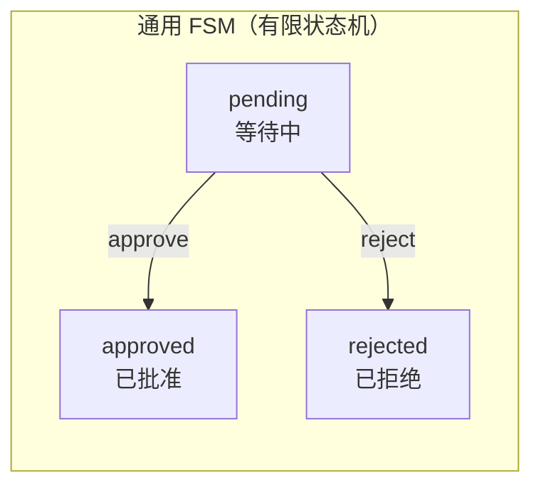
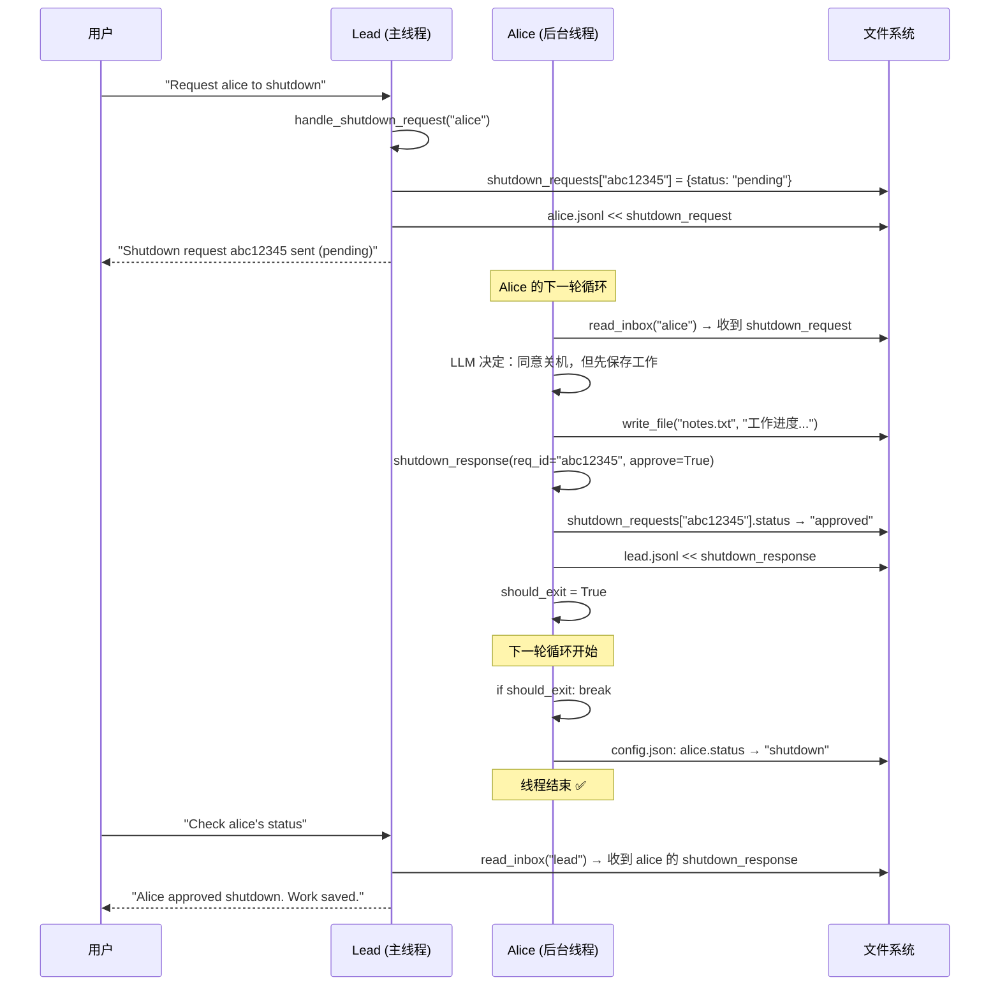
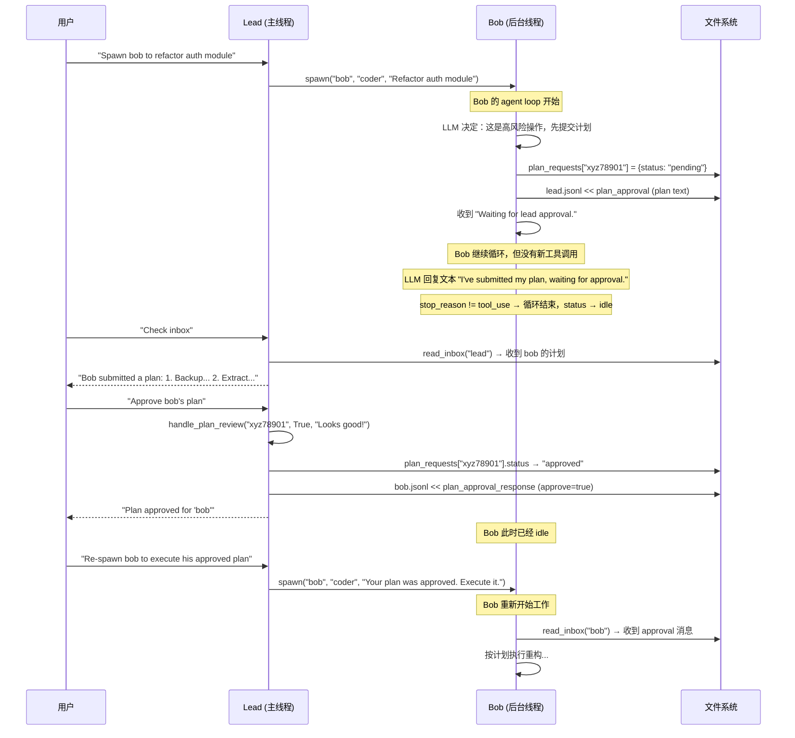

[任务规划]
[读取文件]
好的，源代码已完整获取。下面结合文档和代码进行详细解释。

---

# s10: Team Protocols 团队协议 —— 详细解释与具体示例

## 一、要解决什么问题？

s09 实现了"队友能干活能通信"，但缺少**结构化的协调规矩**。具体有两个痛点：

### 痛点 1：关机没有握手

```
s09 的做法（粗暴）：
  Lead: "alice 你可以停了"
  Alice 的线程: ... 正在写文件写到一半 ...
  Lead: 直接杀线程 💀
  
  结果:
  ├── calc.py 写了一半，内容不完整 ❌
  ├── config.json 里 alice 状态还是 "working" ❌
  └── alice 的收件箱里还有未处理的消息 ❌
```

**理想做法**：

```
s10 的做法（优雅握手）：
  Lead: "alice，请你关机" (shutdown_request, req_id="abc123")
  Alice: "等一下，我把文件写完..."
  Alice: 写完文件，保存工作
  Alice: "好了，我同意关机" (shutdown_response, req_id="abc123", approve=true)
  Alice 的线程: 优雅退出 ✅
  config.json: alice status → "shutdown" ✅
```

### 痛点 2：高风险操作没有审批

```
s09 的做法（直接开干）：
  Lead: "bob，重构认证模块"
  Bob: 收到！立刻开始删代码、改代码...
  Bob: 改了 50 个文件，把线上服务搞崩了 💥
  
  没有人审查过 bob 的计划！
```

**理想做法**：

```
s10 的做法（先审后干）：
  Lead: "bob，重构认证模块"
  Bob: 我先提交一个计划 (plan_approval, req_id="xyz789")
       "计划：1. 备份现有代码 2. 抽取接口 3. 逐步替换 4. 跑测试"
  Lead: 审查计划... 
  Lead: "计划批准！" (plan_approval, req_id="xyz789", approve=true)
  Bob: 收到批准，开始按计划执行 ✅
```

---

## 二、核心设计：一个模式，两种用途

s10 最精妙的地方在于：**关机协议和计划审批协议用的是完全相同的模式**。

```
通用的 Request-Response 模式：

1. 发起方生成唯一的 request_id
2. 发起方通过收件箱发送请求
3. 接收方处理请求
4. 接收方引用同一个 request_id 发送响应
5. 状态机: pending → approved | rejected
```

用一张图表示：



这个 FSM 被复用了两次：

| 协议 | 发起方 | 接收方 | 请求类型 | 响应类型 |
|---|---|---|---|---|
| **关机协议** | Lead（领导） | Teammate（队友） | `shutdown_request` | `shutdown_response` |
| **计划审批** | Teammate（队友） | Lead（领导） | `plan_approval` 提交 | `plan_approval_response` |

注意方向是**反的**：关机是领导→队友，计划审批是队友→领导。但模式完全一样。

---

## 三、两个 Tracker（追踪器）

```python
shutdown_requests = {}    # {req_id: {"target": "alice", "status": "pending"}}
plan_requests = {}        # {req_id: {"from": "bob", "plan": "...", "status": "pending"}}
_tracker_lock = threading.Lock()
```

Tracker 是**内存中的字典**，用来追踪每个请求的状态。

### 为什么需要 Tracker？

因为请求和响应是**异步的**——领导发出关机请求后，不知道队友什么时候才会响应。Tracker 让领导可以随时查询："我之前发的那个关机请求，队友同意了吗？"

### 为什么需要 `_tracker_lock`？

因为领导（主线程）和队友（后台线程）会**同时读写** Tracker：

```
主线程（领导）: shutdown_requests["abc"] = {"target": "alice", "status": "pending"}
后台线程（alice）: shutdown_requests["abc"]["status"] = "approved"  ← 同时修改！
```

`threading.Lock()` 确保同一时刻只有一个线程在操作 Tracker。

---

## 四、关机协议 —— 逐步详解

### 4.1 领导发起关机请求

```python
def handle_shutdown_request(teammate: str) -> str:
    req_id = str(uuid.uuid4())[:8]                                    # 1. 生成唯一 ID
    with _tracker_lock:
        shutdown_requests[req_id] = {"target": teammate, "status": "pending"}  # 2. 注册到 Tracker
    BUS.send(
        "lead", teammate, "Please shut down gracefully.",             # 3. 发送到队友收件箱
        "shutdown_request", {"request_id": req_id},
    )
    return f"Shutdown request {req_id} sent to '{teammate}' (status: pending)"
```

#### 具体示例

```python
handle_shutdown_request("alice")
```

执行过程：

1. 生成 `req_id = "abc12345"`
2. `shutdown_requests = {"abc12345": {"target": "alice", "status": "pending"}}`
3. 往 `alice.jsonl` 追加：

```json
{
  "type": "shutdown_request",
  "from": "lead",
  "content": "Please shut down gracefully.",
  "request_id": "abc12345",
  "timestamp": 1711500000.0
}
```

4. 返回 `"Shutdown request abc12345 sent to 'alice' (status: pending)"`

### 4.2 队友收到请求并响应

在队友的 `_exec()` 方法中：

```python
if tool_name == "shutdown_response":
    req_id = args["request_id"]
    approve = args["approve"]
    
    # 更新 Tracker 状态
    with _tracker_lock:
        if req_id in shutdown_requests:
            shutdown_requests[req_id]["status"] = "approved" if approve else "rejected"
    
    # 通过收件箱通知领导
    BUS.send(
        sender, "lead", args.get("reason", ""),
        "shutdown_response", {"request_id": req_id, "approve": approve},
    )
    return f"Shutdown {'approved' if approve else 'rejected'}"
```

#### 具体示例 — 队友同意关机

```python
# Alice 的 LLM 决定同意关机，调用工具：
# shutdown_response(request_id="abc12345", approve=True, reason="Work saved.")
```

执行过程：

1. `shutdown_requests["abc12345"]["status"]` 从 `"pending"` → `"approved"`
2. 往 `lead.jsonl` 追加：

```json
{
  "type": "shutdown_response",
  "from": "alice",
  "content": "Work saved.",
  "request_id": "abc12345",
  "approve": true,
  "timestamp": 1711500005.0
}
```

3. 返回 `"Shutdown approved"`

### 4.3 队友线程的退出逻辑

在 `_teammate_loop()` 中，有一个关键的 `should_exit` 标志：

```python
def _teammate_loop(self, name: str, role: str, prompt: str):
    # ...
    should_exit = False
    for _ in range(50):
        inbox = BUS.read_inbox(name)
        for msg in inbox:
            messages.append({"role": "user", "content": json.dumps(msg)})
        
        if should_exit:       # ★ 如果上一轮批准了关机，这里退出
            break
        
        # ... LLM 调用 ...
        
        for block in response.content:
            if block.type == "tool_use":
                output = self._exec(name, block.name, block.input)
                # ...
                if block.name == "shutdown_response" and block.input.get("approve"):
                    should_exit = True    # ★ 标记：下一轮退出
        
        # ...
    
    member = self._find_member(name)
    if member:
        member["status"] = "shutdown" if should_exit else "idle"    # ★ 设置最终状态
        self._save_config()
```

**为什么不立即退出，而是等到下一轮？**

因为当前轮可能还有其他工具调用需要执行完。比如 Alice 可能在同一轮中：

```
1. shutdown_response(approve=True)    ← 同意关机
2. write_file("notes.txt", "...")     ← 保存工作笔记
```

如果在第 1 步就退出，第 2 步就执行不了了。`should_exit = True` 只是标记，让当前轮的所有工具都执行完，下一轮循环开始时再退出。

### 4.4 完整关机流程时间线



#### 具体示例 — 队友拒绝关机

```
s10 >> Spawn alice as a coder with task "write a web server". Then request her shutdown.
```

Alice 可能正在写代码写到一半，她的 LLM 决定拒绝：

```python
# Alice 的 LLM 调用：
# shutdown_response(request_id="abc12345", approve=False, reason="I'm in the middle of writing server.py")
```

执行过程：

1. `shutdown_requests["abc12345"]["status"]` → `"rejected"`
2. 往 `lead.jsonl` 追加 `{"type":"shutdown_response", "approve": false, "content": "I'm in the middle of writing server.py"}`
3. Alice 的 `should_exit` 保持 `False`，继续工作
4. 领导收到拒绝消息，可以选择等一会儿再请求，或者强制处理

---

## 五、计划审批协议 —— 逐步详解

### 5.1 队友提交计划

在队友的 `_exec()` 方法中：

```python
if tool_name == "plan_approval":
    plan_text = args.get("plan", "")
    req_id = str(uuid.uuid4())[:8]                                    # 1. 队友自己生成 request_id
    with _tracker_lock:
        plan_requests[req_id] = {"from": sender, "plan": plan_text, "status": "pending"}  # 2. 注册
    BUS.send(
        sender, "lead", plan_text, "plan_approval_response",          # 3. 发给领导
        {"request_id": req_id, "plan": plan_text},
    )
    return f"Plan submitted (request_id={req_id}). Waiting for lead approval."
```

#### 具体示例

```python
# Bob 的 LLM 调用：
# plan_approval(plan="1. Backup auth module\n2. Extract interfaces\n3. Implement new auth\n4. Run tests")
```

执行过程：

1. 生成 `req_id = "xyz78901"`
2. `plan_requests = {"xyz78901": {"from": "bob", "plan": "1. Backup auth module...", "status": "pending"}}`
3. 往 `lead.jsonl` 追加：

```json
{
  "type": "plan_approval_response",
  "from": "bob",
  "content": "1. Backup auth module\n2. Extract interfaces\n3. Implement new auth\n4. Run tests",
  "request_id": "xyz78901",
  "plan": "1. Backup auth module\n2. Extract interfaces\n3. Implement new auth\n4. Run tests",
  "timestamp": 1711500010.0
}
```

4. 返回 `"Plan submitted (request_id=xyz78901). Waiting for lead approval."`

### 5.2 领导审批计划

```python
def handle_plan_review(request_id: str, approve: bool, feedback: str = "") -> str:
    with _tracker_lock:
        req = plan_requests.get(request_id)
    if not req:
        return f"Error: Unknown plan request_id '{request_id}'"
    with _tracker_lock:
        req["status"] = "approved" if approve else "rejected"         # 更新状态
    BUS.send(
        "lead", req["from"], feedback, "plan_approval_response",      # 发回给队友
        {"request_id": request_id, "approve": approve, "feedback": feedback},
    )
    return f"Plan {req['status']} for '{req['from']}'"
```

#### 具体示例 — 领导批准计划

```python
# Lead 的 LLM 调用：
# plan_approval(request_id="xyz78901", approve=True, feedback="Good plan! Go ahead.")
```

执行过程：

1. 查找 `plan_requests["xyz78901"]` → `{"from": "bob", "plan": "...", "status": "pending"}`
2. 状态更新为 `"approved"`
3. 往 `bob.jsonl` 追加：

```json
{
  "type": "plan_approval_response",
  "from": "lead",
  "content": "Good plan! Go ahead.",
  "request_id": "xyz78901",
  "approve": true,
  "feedback": "Good plan! Go ahead.",
  "timestamp": 1711500015.0
}
```

4. 返回 `"Plan approved for 'bob'"`

#### 具体示例 — 领导拒绝计划

```python
# Lead 的 LLM 调用：
# plan_approval(request_id="xyz78901", approve=False, feedback="Too risky. Add a rollback step.")
```

Bob 收到拒绝后，可以修改计划重新提交（生成新的 request_id）。

### 5.3 完整计划审批流程时间线



---

## 六、工具集对比：领导 vs 队友

### 领导的 12 个工具

```
基础工具（4 个）:     bash, read_file, write_file, edit_file
团队管理（3 个）:     spawn_teammate, list_teammates, broadcast
通信（2 个）:         send_message, read_inbox
协议工具（3 个）:     shutdown_request, shutdown_response*, plan_approval
                      (* 领导的 shutdown_response 是查询状态，不是响应)
```

### 队友的 8 个工具

```
基础工具（4 个）:     bash, read_file, write_file, edit_file
通信（2 个）:         send_message, read_inbox
协议工具（2 个）:     shutdown_response, plan_approval
                      (shutdown_response = 响应关机请求)
                      (plan_approval = 提交计划)
```

**注意同名工具的不同含义**：

| 工具名 | 领导调用时 | 队友调用时 |
|---|---|---|
| `shutdown_response` | **查询**关机请求的状态 | **响应**关机请求（同意/拒绝） |
| `plan_approval` | **审批**队友的计划 | **提交**计划给领导 |

这是一个巧妙的设计：同一个工具名，根据调用者身份执行不同的逻辑。

---

## 七、完整交互示例

### 示例 1：关机协议的完整流程

```
s10 >> Spawn alice as a coder. Have her write a hello.py file. Then request her shutdown.
```

**控制台输出**：

```
> spawn_teammate: Spawned 'alice' (role: coder)
  [alice] write_file: Wrote 45 bytes                    ← Alice 在后台写文件
> send_message: Sent message to alice                   ← Lead 告诉 alice 写完后准备关机
> shutdown_request: Shutdown request a1b2c3d4 sent to 'alice' (status: pending)
  [alice] shutdown_response: Shutdown approved           ← Alice 同意关机
```

**磁盘变化**：

```
t=0s  .team/config.json:
      members: [{"name":"alice", "role":"coder", "status":"working"}]

t=2s  hello.py 被创建
      .team/inbox/lead.jsonl << alice 的 shutdown_response

t=3s  .team/config.json:
      members: [{"name":"alice", "role":"coder", "status":"shutdown"}]
```

```
s10 >> /team
Team: default
  alice (coder): shutdown
```

### 示例 2：计划审批 → 拒绝 → 修改 → 批准

```
s10 >> Spawn bob as a coder with task "refactor the database layer". 
       He should submit a plan first.
```

**第一轮：Bob 提交计划**

```
> spawn_teammate: Spawned 'bob' (role: coder)
  [bob] plan_approval: Plan submitted (request_id=x1y2z3). Waiting for lead approval.
```

```
s10 >> Check my inbox
```

```
> read_inbox: [
    {
      "type": "plan_approval_response",
      "from": "bob",
      "content": "Plan:\n1. Drop old tables\n2. Create new schema\n3. Migrate data",
      "request_id": "x1y2z3",
      "plan": "Plan:\n1. Drop old tables\n2. Create new schema\n3. Migrate data"
    }
  ]
```

**第二轮：领导拒绝计划**

```
s10 >> Reject bob's plan x1y2z3. Tell him dropping tables is too risky, 
       he should add a backup step first.
```

```
> plan_approval: Plan rejected for 'bob'
```

Bob 收到拒绝消息后，修改计划重新提交：

```
  [bob] plan_approval: Plan submitted (request_id=a4b5c6). Waiting for lead approval.
```

```
s10 >> Check inbox again
```

```
> read_inbox: [
    {
      "type": "plan_approval_response",
      "from": "bob",
      "content": "Revised Plan:\n1. Backup all tables\n2. Create new schema\n3. Migrate data\n4. Verify\n5. Drop old tables",
      "request_id": "a4b5c6"
    }
  ]
```

**第三轮：领导批准修改后的计划**

```
s10 >> Approve bob's revised plan a4b5c6. Looks good now.
```

```
> plan_approval: Plan approved for 'bob'
```

Bob 收到批准后开始执行。

### 示例 3：队友拒绝关机

```
s10 >> Spawn charlie as a coder with task "write a complex parser". 
       After 5 seconds, request his shutdown.
```

```
> spawn_teammate: Spawned 'charlie' (role: coder)
  [charlie] write_file: Wrote 1200 bytes                ← Charlie 正在写代码
  [charlie] write_file: Wrote 800 bytes                  ← 还在写...
> shutdown_request: Shutdown request d7e8f9 sent to 'charlie' (status: pending)
  [charlie] shutdown_response: Shutdown rejected          ← Charlie 拒绝了！
```

```
s10 >> Check shutdown status d7e8f9
```

```
> shutdown_response: {"target": "charlie", "status": "rejected"}
```

```
s10 >> /team
Team: default
  charlie (coder): idle          ← Charlie 自然完成任务后变为 idle（不是 shutdown）
```

Charlie 拒绝关机后继续工作，直到自然完成任务变为 `idle`。

---

## 八、request_id 关联机制详解

`request_id` 是整个协议系统的**灵魂**。它解决了一个核心问题：**异步通信中如何把请求和响应对应起来？**

### 没有 request_id 的混乱场景

```
Lead → Alice: "请关机"
Lead → Bob:   "请关机"

Alice → Lead: "我同意关机"
Bob → Lead:   "我拒绝关机"

问题：Lead 收到两条响应，怎么知道哪条是 Alice 的，哪条是 Bob 的？
虽然有 "from" 字段，但如果 Lead 给同一个人发了两次关机请求呢？
```

### 有 request_id 的清晰场景

```
Lead → Alice: shutdown_request {request_id: "aaa"}
Lead → Bob:   shutdown_request {request_id: "bbb"}

Alice → Lead: shutdown_response {request_id: "aaa", approve: true}
Bob → Lead:   shutdown_response {request_id: "bbb", approve: false}

Lead 查 Tracker:
  shutdown_requests["aaa"] → {target: "alice", status: "approved"} ✅
  shutdown_requests["bbb"] → {target: "bob", status: "rejected"}   ✅
```

每个请求有唯一 ID，响应引用同一个 ID，**一一对应，绝不混淆**。

---

## 九、队友的 System Prompt 变化

对比 s09 和 s10 队友的 system prompt：

```python
# s09:
sys_prompt = (
    f"You are '{name}', role: {role}, at {WORKDIR}. "
    f"Use send_message to communicate. Complete your task."
)

# s10:
sys_prompt = (
    f"You are '{name}', role: {role}, at {WORKDIR}. "
    f"Submit plans via plan_approval before major work. "      # ★ 新增：要求先提交计划
    f"Respond to shutdown_request with shutdown_response."     # ★ 新增：要求响应关机请求
)
```

通过 system prompt 引导队友的 LLM：
1. 做大事之前先提交计划
2. 收到关机请求时要用 `shutdown_response` 工具响应

---

## 十、与 s09 的对比总结

| 组件 | s09 (团队) | s10 (团队协议) |
|---|---|---|
| **工具数量** | 领导 9 / 队友 6 | 领导 12 / 队友 8 |
| **关机方式** | 自然退出（线程跑完就停） | 请求-响应握手 |
| **计划管控** | 无（队友直接开干） | 提交→审查→批准/拒绝 |
| **请求关联** | 无 | 每个请求一个 `request_id` |
| **状态机** | 无 | `pending → approved \| rejected` |
| **队友最终状态** | 只有 `idle` | `idle`（自然完成）或 `shutdown`（优雅关机） |

---

## 十一、设计模式的通用性

文档中有一句关键洞察：

> **"一个 FSM，两种用途。同样的 `pending → approved | rejected` 状态机可以套用到任何请求-响应协议上。"**

这意味着如果你需要新增协议，只需要：

1. 新建一个 Tracker 字典：`code_review_requests = {}`
2. 发起方生成 `request_id`，注册到 Tracker
3. 接收方引用 `request_id` 响应
4. 状态机：`pending → approved | rejected`

比如可以轻松扩展出：

```
代码审查协议:    队友提交代码 → 领导审查 → 批准/打回
资源申请协议:    队友申请资源 → 领导审批 → 批准/拒绝
任务转交协议:    队友 A 请求转交 → 队友 B 接受/拒绝
```

所有这些都复用同一个 `pending → approved | rejected` 的 FSM 骨架。这就是**协议抽象**的力量——用最少的代码覆盖最多的场景。