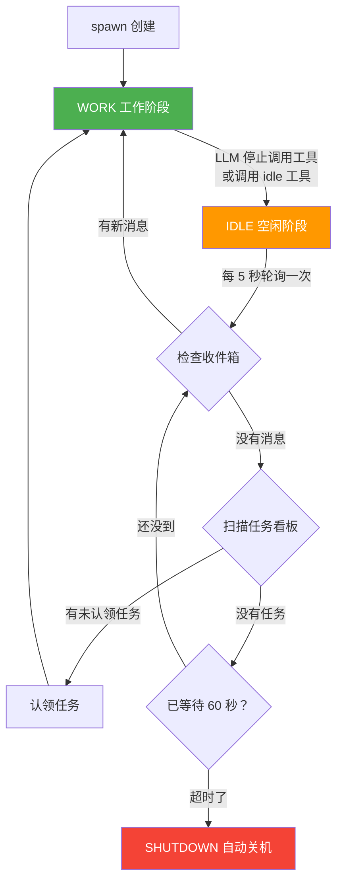
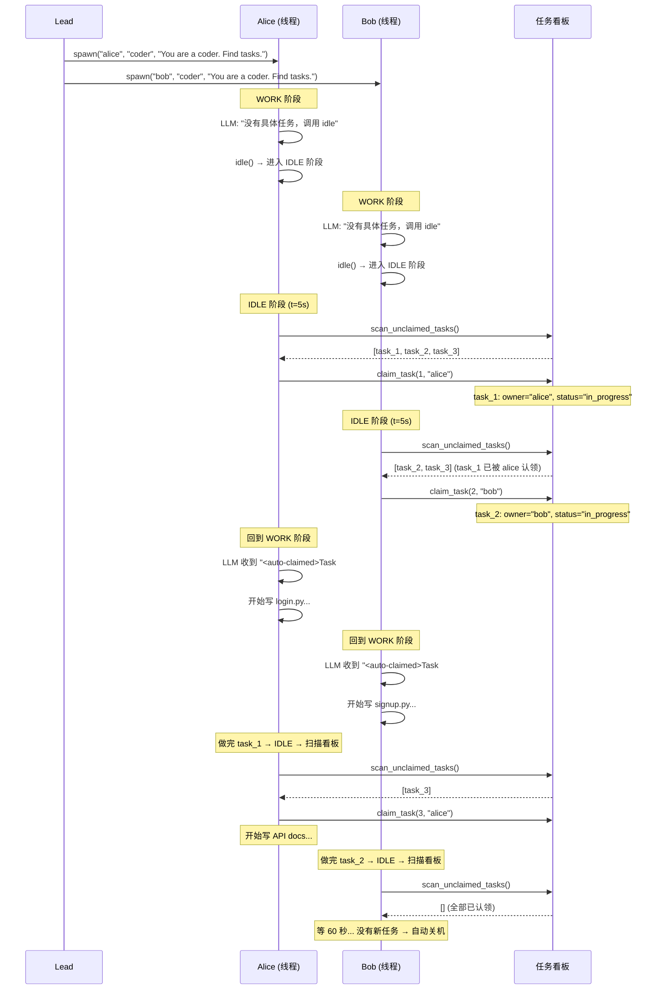

[任务规划]
好的，让我先读取源代码文件来结合文档进行详细解释。
[读取文件]
# s11: Autonomous Agents（自治智能体）—— 详细解释与具体示例

## 一、要解决什么问题？

s10 实现了"关机协议"和"计划审批协议"，但队友仍然是**被动的**——领导必须逐个分配任务。想象一下这个场景：

### s10 的痛点：领导是瓶颈

```
任务看板上有 10 个任务:
  [ ] #1: 写登录页面
  [ ] #2: 写注册页面
  [ ] #3: 写数据库模型
  [ ] #4: 写 API 接口
  ... 还有 6 个 ...

领导必须手动分配:
  Lead: spawn alice, prompt="写登录页面"
  Lead: spawn bob, prompt="写注册页面"
  Lead: spawn charlie, prompt="写数据库模型"
  ... 还得等他们做完再分配下一批 ...

问题:
├── 领导成了瓶颈 —— 10 个任务得手动分配 10 次 ❌
├── 队友做完就停了 —— 不会自己找下一个任务 ❌
└── 扩展不了 —— 50 个任务怎么办？ ❌
```

### s11 的理想做法：自组织

```
任务看板上有 10 个任务:
  [ ] #1: 写登录页面
  [ ] #2: 写注册页面
  ...

领导只需要:
  Lead: "创建任务，然后 spawn alice 和 bob"

然后 alice 和 bob 自己:
  Alice: 扫描看板 → 发现 #1 没人做 → 认领 #1 → 开始写登录页面
  Bob:   扫描看板 → 发现 #2 没人做 → 认领 #2 → 开始写注册页面
  Alice: 做完 #1 → 进入空闲 → 扫描看板 → 发现 #3 没人做 → 认领 #3 → 继续干
  Bob:   做完 #2 → 进入空闲 → 扫描看板 → 发现 #4 没人做 → 认领 #4 → 继续干
  ...
  Alice: 做完 → 扫描看板 → 没有新任务了 → 等 60 秒 → 自动关机 ✅
```

**核心思想：队友自己找活干，不需要领导逐个分配。**

---

## 二、核心架构：队友的生命周期

s11 最关键的变化是给队友引入了 **WORK → IDLE 双阶段循环**：



对比 s10：

| | s10 | s11 |
|---|---|---|
| 做完任务后 | 线程直接结束，状态变 `idle` | 进入 IDLE 阶段，主动找新任务 |
| 没有新任务 | 永远停着 | 等 60 秒后自动关机 |
| 任务分配 | 领导手动 spawn + prompt | 队友自己扫描看板认领 |

---

## 三、新增组件详解

### 3.1 任务看板（Task Board）

任务以 JSON 文件的形式存储在 `.tasks/` 目录下：

```
.tasks/
├── task_1.json
├── task_2.json
└── task_3.json
```

每个任务文件的结构：

```json
{
  "id": 1,
  "subject": "Write login page",
  "description": "Create a login page with username and password fields",
  "status": "pending",
  "owner": null,
  "blockedBy": null
}
```

字段含义：

| 字段 | 含义 | 可能的值 |
|---|---|---|
| `id` | 任务唯一编号 | 1, 2, 3... |
| `subject` | 任务标题 | 任意字符串 |
| `description` | 任务详细描述 | 任意字符串 |
| `status` | 任务状态 | `"pending"` / `"in_progress"` / `"completed"` |
| `owner` | 认领者 | `null`（未认领）或 `"alice"` 等 |
| `blockedBy` | 被哪个任务阻塞 | `null` 或任务 ID |

### 3.2 扫描未认领任务

```python
def scan_unclaimed_tasks() -> list:
    TASKS_DIR.mkdir(exist_ok=True)
    unclaimed = []
    for f in sorted(TASKS_DIR.glob("task_*.json")):
        task = json.loads(f.read_text())
        if (task.get("status") == "pending"          # 状态是 pending
                and not task.get("owner")             # 没有 owner
                and not task.get("blockedBy")):       # 没有被阻塞
            unclaimed.append(task)
    return unclaimed
```

**三个条件缺一不可**：

```
task_1.json: status="pending", owner=null, blockedBy=null     → ✅ 可认领
task_2.json: status="pending", owner=null, blockedBy=1        → ❌ 被 task_1 阻塞
task_3.json: status="pending", owner="alice", blockedBy=null  → ❌ 已被 alice 认领
task_4.json: status="in_progress", owner="bob", blockedBy=null → ❌ 已在进行中
task_5.json: status="completed", owner="bob", blockedBy=null  → ❌ 已完成
```

### 3.3 认领任务

```python
def claim_task(task_id: int, owner: str) -> str:
    with _claim_lock:                                    # 加锁，防止两个队友同时认领同一个任务
        path = TASKS_DIR / f"task_{task_id}.json"
        if not path.exists():
            return f"Error: Task {task_id} not found"
        task = json.loads(path.read_text())
        task["owner"] = owner                            # 设置 owner
        task["status"] = "in_progress"                   # 状态变为进行中
        path.write_text(json.dumps(task, indent=2))
    return f"Claimed task #{task_id} for {owner}"
```

**为什么需要 `_claim_lock`？**

```
没有锁的情况（竞态条件）：
  t=0ms  Alice 读取 task_1.json → owner=null ✓ 可以认领
  t=1ms  Bob   读取 task_1.json → owner=null ✓ 可以认领（Alice 还没写回去！）
  t=2ms  Alice 写入 task_1.json → owner="alice"
  t=3ms  Bob   写入 task_1.json → owner="bob"  ← 覆盖了 Alice 的认领！
  
  结果：Alice 以为自己认领了，但实际上被 Bob 覆盖了 💥

有锁的情况（安全）：
  t=0ms  Alice 获取锁 → 读取 → owner=null → 写入 owner="alice" → 释放锁
  t=1ms  Bob   获取锁 → 读取 → owner="alice" → 已被认领，跳过 → 释放锁
  
  结果：Alice 认领成功，Bob 会去找下一个任务 ✅
```

### 3.4 两个新工具

| 工具 | 谁用 | 作用 |
|---|---|---|
| `idle` | 队友 | 主动告诉系统"我没活干了"，进入空闲轮询阶段 |
| `claim_task` | 队友/领导 | 手动认领指定 ID 的任务 |

---

## 四、队友的 `_loop()` 方法 —— 逐步详解

这是 s11 最核心的代码，我们逐段拆解：

### 4.1 WORK 阶段

```python
def _loop(self, name: str, role: str, prompt: str):
    team_name = self.config["team_name"]
    sys_prompt = (
        f"You are '{name}', role: {role}, team: {team_name}, at {WORKDIR}. "
        f"Use idle tool when you have no more work. You will auto-claim new tasks."
    )
    messages = [{"role": "user", "content": prompt}]
    tools = self._teammate_tools()

    while True:                                    # ★ 外层无限循环：WORK → IDLE → WORK → IDLE → ...
        # -- WORK PHASE --
        for _ in range(50):                        # 最多 50 轮工具调用
            inbox = BUS.read_inbox(name)
            for msg in inbox:
                if msg.get("type") == "shutdown_request":
                    self._set_status(name, "shutdown")
                    return                         # 收到关机请求，立即退出
                messages.append({"role": "user", "content": json.dumps(msg)})
            
            response = client.messages.create(...)
            messages.append({"role": "assistant", "content": response.content})
            
            if response.stop_reason != "tool_use":
                break                              # LLM 不再调用工具 → 退出 WORK 阶段
            
            results = []
            idle_requested = False
            for block in response.content:
                if block.type == "tool_use":
                    if block.name == "idle":
                        idle_requested = True      # ★ 队友主动请求空闲
                        output = "Entering idle phase. Will poll for new tasks."
                    else:
                        output = self._exec(name, block.name, block.input)
                    results.append(...)
            messages.append({"role": "user", "content": results})
            
            if idle_requested:
                break                              # ★ idle 工具被调用 → 退出 WORK 阶段
```

**WORK 阶段退出的两种方式**：

1. **LLM 自然停止**：`stop_reason != "tool_use"`，LLM 认为任务完成了
2. **LLM 主动调用 `idle` 工具**：明确表示"我没活干了"

#### 具体示例 — WORK 阶段

```
Alice 收到 prompt: "Write a hello.py file"

第 1 轮:
  LLM → write_file("hello.py", "print('hello')")    ← 调用工具
  [alice] write_file: Wrote 15 bytes

第 2 轮:
  LLM → "I've created hello.py. No more work to do."  ← stop_reason = "end_turn"
  
→ 退出 WORK 阶段，进入 IDLE 阶段
```

或者：

```
Alice 收到 prompt: "Write a hello.py file"

第 1 轮:
  LLM → write_file("hello.py", "print('hello')")
  [alice] write_file: Wrote 15 bytes

第 2 轮:
  LLM → idle()                                        ← 主动调用 idle 工具
  [alice] idle: Entering idle phase. Will poll for new tasks.
  
→ 退出 WORK 阶段，进入 IDLE 阶段
```

### 4.2 IDLE 阶段

```python
        # -- IDLE PHASE --
        self._set_status(name, "idle")                 # 状态 → idle
        resume = False
        polls = IDLE_TIMEOUT // max(POLL_INTERVAL, 1)  # 60 / 5 = 12 次轮询
        
        for _ in range(polls):                         # 最多轮询 12 次
            time.sleep(POLL_INTERVAL)                  # 每次等 5 秒
            
            # 检查 1: 收件箱有新消息？
            inbox = BUS.read_inbox(name)
            if inbox:
                for msg in inbox:
                    if msg.get("type") == "shutdown_request":
                        self._set_status(name, "shutdown")
                        return                         # 关机请求 → 退出
                    messages.append({"role": "user", "content": json.dumps(msg)})
                resume = True
                break                                  # 有消息 → 恢复工作
            
            # 检查 2: 任务看板有未认领任务？
            unclaimed = scan_unclaimed_tasks()
            if unclaimed:
                task = unclaimed[0]                     # 取第一个未认领任务
                claim_task(task["id"], name)            # 认领它
                task_prompt = (
                    f"<auto-claimed>Task #{task['id']}: {task['subject']}\n"
                    f"{task.get('description', '')}</auto-claimed>"
                )
                # 身份重注入（如果上下文被压缩过）
                if len(messages) <= 3:
                    messages.insert(0, make_identity_block(name, role, team_name))
                    messages.insert(1, {"role": "assistant", "content": f"I am {name}. Continuing."})
                messages.append({"role": "user", "content": task_prompt})
                messages.append({"role": "assistant", "content": f"Claimed task #{task['id']}. Working on it."})
                resume = True
                break                                  # 认领成功 → 恢复工作
        
        if not resume:
            self._set_status(name, "shutdown")         # 60 秒没有新活 → 自动关机
            return
        self._set_status(name, "working")              # 有新活 → 恢复工作状态
```

#### 具体示例 — IDLE 阶段的三种结局

**结局 1：收到新消息 → 恢复工作**

```
Alice 进入 IDLE 阶段
  t=0s   状态 → idle
  t=5s   检查收件箱 → 空，检查看板 → 空
  t=10s  检查收件箱 → 空，检查看板 → 空
  t=15s  检查收件箱 → 收到领导消息: "Please also write tests.py"
         → resume = True
         → 状态 → working
         → 回到 WORK 阶段，LLM 收到新消息开始写 tests.py
```

**结局 2：发现未认领任务 → 自动认领并恢复工作**

```
Alice 进入 IDLE 阶段
  t=0s   状态 → idle
  t=5s   检查收件箱 → 空
         检查看板 → 发现 task_3.json: {status:"pending", owner:null, subject:"Write API docs"}
         → claim_task(3, "alice")
         → task_3.json 变为: {status:"in_progress", owner:"alice"}
         → messages 追加: "<auto-claimed>Task #3: Write API docs</auto-claimed>"
         → resume = True
         → 状态 → working
         → 回到 WORK 阶段，LLM 开始写 API 文档
```

**结局 3：60 秒超时 → 自动关机**

```
Alice 进入 IDLE 阶段
  t=0s   状态 → idle
  t=5s   检查收件箱 → 空，检查看板 → 空
  t=10s  检查收件箱 → 空，检查看板 → 空
  t=15s  检查收件箱 → 空，检查看板 → 空
  ...
  t=55s  检查收件箱 → 空，检查看板 → 空
  t=60s  12 次轮询全部结束，resume = False
         → 状态 → shutdown
         → 线程结束 ✅
```

---

## 五、身份重注入（Identity Re-injection）

### 5.1 为什么需要？

在 s06 中我们学过**上下文压缩**——当对话太长时，会把旧消息压缩成摘要。但压缩后可能会丢失关键信息：

```
压缩前的 messages:
  [0] user: "You are 'alice', role: coder, team: my-team..."
  [1] assistant: "I'll start writing the login page..."
  [2] user: tool_result: "Wrote 200 bytes"
  [3] assistant: "Login page done. Calling idle."
  ... 被压缩 ...

压缩后的 messages:
  [0] user: "Summary: A coder wrote a login page."     ← alice 是谁？什么角色？什么团队？全丢了！
  [1] assistant: "OK."
```

如果此时 Alice 认领了新任务，LLM 可能不知道自己是谁：

```
LLM 收到: "<auto-claimed>Task #3: Write API docs</auto-claimed>"
LLM 想: "我是谁？我在哪？我该怎么写？" 😵
```

### 5.2 解决方案

```python
# 检测：messages 很短（≤3 条）说明发生了压缩
if len(messages) <= 3:
    # 在开头插入身份信息
    messages.insert(0, make_identity_block(name, role, team_name))
    messages.insert(1, {"role": "assistant", "content": f"I am {name}. Continuing."})
```

`make_identity_block` 生成的内容：

```python
def make_identity_block(name: str, role: str, team_name: str) -> dict:
    return {
        "role": "user",
        "content": f"<identity>You are '{name}', role: {role}, team: {team_name}. Continue your work.</identity>",
    }
```

#### 具体示例

```
压缩后的 messages（只剩 2 条）:
  [0] user: "Summary: A coder wrote a login page."
  [1] assistant: "OK."

身份重注入后的 messages（变成 6 条）:
  [0] user: "<identity>You are 'alice', role: coder, team: my-team. Continue your work.</identity>"  ← 新插入
  [1] assistant: "I am alice. Continuing."                                                           ← 新插入
  [2] user: "Summary: A coder wrote a login page."                                                   ← 原来的
  [3] assistant: "OK."                                                                               ← 原来的
  [4] user: "<auto-claimed>Task #3: Write API docs\nWrite comprehensive API documentation</auto-claimed>"  ← 新任务
  [5] assistant: "Claimed task #3. Working on it."                                                   ← 确认

现在 LLM 知道: "我是 alice，角色是 coder，团队是 my-team，我要写 API 文档" ✅
```

**为什么判断条件是 `len(messages) <= 3`？**

正常工作过程中，messages 会不断增长（每轮至少 +2 条）。如果突然只剩 ≤3 条，说明中间的消息被压缩/清理了。这是一个简单但有效的启发式判断。

---

## 六、队友的 System Prompt 变化

```python
# s10:
sys_prompt = (
    f"You are '{name}', role: {role}, at {WORKDIR}. "
    f"Submit plans via plan_approval before major work. "
    f"Respond to shutdown_request with shutdown_response."
)

# s11:
sys_prompt = (
    f"You are '{name}', role: {role}, team: {team_name}, at {WORKDIR}. "
    f"Use idle tool when you have no more work. You will auto-claim new tasks."
    #  ↑ 新增：告诉队友用 idle 工具，以及会自动认领任务
)
```

关键变化：
1. 新增了 `team: {team_name}` —— 强化团队归属感
2. 引导队友使用 `idle` 工具 —— 而不是直接停止
3. 告知自动认领机制 —— 让 LLM 知道会有新任务自动分配过来

---

## 七、完整交互示例

### 示例 1：创建任务 → 队友自动认领

```
s11 >> Create 3 tasks on the board, then spawn alice and bob as coders.
```

**领导的 LLM 执行**：

```
> write_file: Wrote 120 bytes    ← 创建 .tasks/task_1.json
> write_file: Wrote 130 bytes    ← 创建 .tasks/task_2.json
> write_file: Wrote 125 bytes    ← 创建 .tasks/task_3.json
> spawn_teammate: Spawned 'alice' (role: coder)
> spawn_teammate: Spawned 'bob' (role: coder)
```

**磁盘上的任务文件**：

```json
// .tasks/task_1.json
{"id": 1, "subject": "Write login page", "status": "pending", "owner": null}

// .tasks/task_2.json
{"id": 2, "subject": "Write signup page", "status": "pending", "owner": null}

// .tasks/task_3.json
{"id": 3, "subject": "Write API docs", "status": "pending", "owner": null}
```

**Alice 和 Bob 的后台行为**：



**用 `/tasks` 查看看板**：

```
s11 >> /tasks
  [>] #1: Write login page @alice
  [>] #2: Write signup page @bob
  [ ] #3: Write API docs
```

过一会儿再看：

```
s11 >> /tasks
  [>] #1: Write login page @alice
  [>] #2: Write signup page @bob
  [>] #3: Write API docs @alice
```

**用 `/team` 查看团队状态**：

```
s11 >> /team
Team: default
  alice (coder): working
  bob (coder): idle
```

再过一会儿：

```
s11 >> /team
Team: default
  alice (coder): working
  bob (coder): shutdown       ← Bob 60 秒没找到新任务，自动关机了
```

### 示例 2：带依赖的任务

```
s11 >> Create these tasks:
       Task 1: "Set up database" (no dependencies)
       Task 2: "Write models" (blocked by task 1)
       Task 3: "Write API" (blocked by task 2)
       Then spawn alice.
```

**任务文件**：

```json
// task_1.json
{"id": 1, "subject": "Set up database", "status": "pending", "owner": null, "blockedBy": null}

// task_2.json
{"id": 2, "subject": "Write models", "status": "pending", "owner": null, "blockedBy": 1}

// task_3.json
{"id": 3, "subject": "Write API", "status": "pending", "owner": null, "blockedBy": 2}
```

**Alice 的行为**：

```
Alice IDLE → scan_unclaimed_tasks():
  task_1: pending, no owner, no blockedBy → ✅ 可认领
  task_2: pending, no owner, blockedBy=1  → ❌ 被阻塞
  task_3: pending, no owner, blockedBy=2  → ❌ 被阻塞

Alice 认领 task_1，开始设置数据库

Alice 做完 task_1 → IDLE → scan_unclaimed_tasks():
  task_1: in_progress, owner=alice        → ❌ 已认领
  task_2: pending, no owner, blockedBy=1  → ❌ 仍然被阻塞！
  task_3: pending, no owner, blockedBy=2  → ❌ 仍然被阻塞！
```

**注意**：`scan_unclaimed_tasks()` 只检查 `blockedBy` 字段是否存在，**不会自动解除阻塞**。这意味着需要领导或其他机制来更新 `blockedBy` 字段。领导可以手动解除：

```
s11 >> Task 1 is done. Remove the blockedBy from task 2.
```

```
> edit_file: Edited .tasks/task_2.json    ← blockedBy: 1 → blockedBy: null
```

现在 Alice 下次轮询就能认领 task_2 了。

### 示例 3：空闲超时自动关机

```
s11 >> Spawn charlie as a coder with task "write hello.py"
```

```
> spawn_teammate: Spawned 'charlie' (role: coder)
  [charlie] write_file: Wrote 22 bytes
  [charlie] idle: Entering idle phase. Will poll for new tasks.
```

```
s11 >> /team
Team: default
  charlie (coder): idle          ← Charlie 在空闲轮询中
```

等 60 秒后（没有新任务，没有新消息）：

```
s11 >> /team
Team: default
  charlie (coder): shutdown      ← Charlie 自动关机了
```

**时间线**：

```
t=0s   Charlie 完成 hello.py → 进入 IDLE
t=5s   轮询 #1: 收件箱空，看板空
t=10s  轮询 #2: 收件箱空，看板空
t=15s  轮询 #3: 收件箱空，看板空
...
t=55s  轮询 #11: 收件箱空，看板空
t=60s  轮询 #12: 收件箱空，看板空
       → resume = False → shutdown
```

---

## 八、工具集对比：s10 → s11

### 领导的工具：12 → 14

```diff
  基础工具（4 个）:     bash, read_file, write_file, edit_file
  团队管理（3 个）:     spawn_teammate, list_teammates, broadcast
  通信（2 个）:         send_message, read_inbox
  协议工具（3 个）:     shutdown_request, shutdown_response, plan_approval
+ 自治工具（2 个）:     idle, claim_task                              ← 新增
```

### 队友的工具：8 → 10

```diff
  基础工具（4 个）:     bash, read_file, write_file, edit_file
  通信（2 个）:         send_message, read_inbox
  协议工具（2 个）:     shutdown_response, plan_approval
+ 自治工具（2 个）:     idle, claim_task                              ← 新增
```

---

## 九、关键常量

```python
POLL_INTERVAL = 5     # 每 5 秒轮询一次
IDLE_TIMEOUT = 60     # 空闲 60 秒后自动关机
```

这意味着：
- 最多轮询 `60 / 5 = 12` 次
- 新任务最多等 5 秒就会被发现
- 没有新任务的队友最多存活 60 秒就会自动清理

---

## 十、总结对比表

| 组件 | s10 (团队协议) | s11 (自治智能体) |
|---|---|---|
| **工具数量** | 领导 12 / 队友 8 | 领导 14 / 队友 10 |
| **自治性** | 领导指派任务 | 队友自己扫描看板认领 |
| **空闲阶段** | 无（做完就停） | 轮询收件箱 + 任务看板 |
| **任务认领** | 仅手动 | 自动认领未分配任务 |
| **身份保持** | 仅靠 system prompt | + 压缩后重注入 identity block |
| **超时机制** | 无 | 60 秒空闲 → 自动关机 |
| **新增工具** | — | `idle`（进入空闲）、`claim_task`（认领任务） |
| **核心思想** | 结构化协议 | **队友自己找活干** |

**一句话总结**：s11 让队友从"被动等指令"变成了"主动找活干"，实现了真正的自组织团队。领导只需要往看板上放任务，队友会自动认领、执行、完成后继续找下一个，直到没有活干了自动关机。