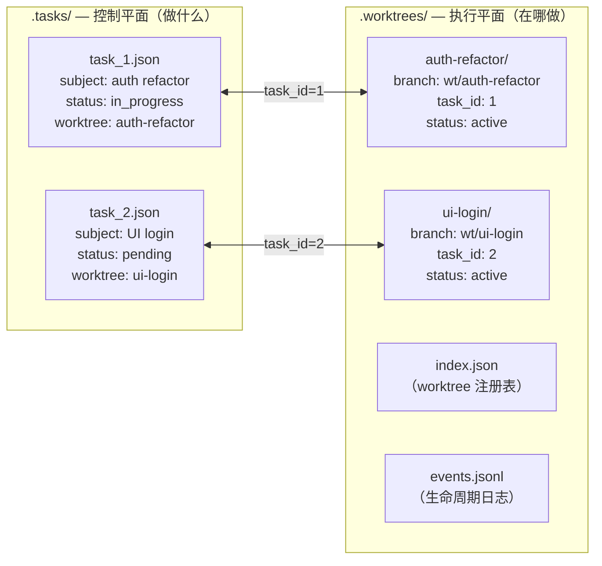

[任务规划]
好的，让我先读取 s12 的源代码文件来结合文档进行详细解释。
[读取文件]
# s12: Worktree + Task Isolation（Worktree 任务隔离）—— 详细解释与具体示例

## 一、要解决什么问题？

s11 实现了"自治智能体"——队友能自己找活干。但有一个致命问题：**所有人共享同一个工作目录**。

### s11 的痛点：目录冲突

```
场景：Alice 和 Bob 同时在同一个目录下工作

Alice 的任务: 重构 auth 模块
  → 修改 config.py: 把 AUTH_SECRET 改成 AUTH_TOKEN
  → 修改 app.py: 导入新的 auth 模块

Bob 的任务: 重构 UI 登录页
  → 修改 config.py: 添加 LOGIN_TIMEOUT 配置
  → 修改 app.py: 添加新的路由

问题来了：
  t=0s  Alice 修改 config.py → 加了 AUTH_TOKEN
  t=1s  Bob   修改 config.py → 加了 LOGIN_TIMEOUT，但覆盖了 Alice 的改动！💥
  t=2s  Alice 想回滚？git diff 里混着 Bob 的改动，分不清谁改了什么 💥
  t=3s  Bob 运行测试？Alice 改了一半的 app.py 导致 Bob 的测试也挂了 💥
```

**根本原因**：任务板管"做什么"，但不管"在哪做"。

### s12 的解法：每个任务一个独立目录

```
.worktrees/
├── auth-refactor/          ← Alice 的独立目录（完整的代码副本）
│   ├── config.py           ← Alice 随便改，不影响 Bob
│   ├── app.py
│   └── ...
├── ui-login/               ← Bob 的独立目录（完整的代码副本）
│   ├── config.py           ← Bob 随便改，不影响 Alice
│   ├── app.py
│   └── ...
├── index.json              ← worktree 注册表
└── events.jsonl            ← 生命周期事件日志
```

**核心思想：用 git worktree 给每个任务创建独立的工作目录，通过任务 ID 把"做什么"和"在哪做"关联起来。**

---

## 二、什么是 Git Worktree？

在理解 s12 之前，先搞清楚 git worktree 是什么。

### 普通 git 仓库

```
my-project/          ← 只有一个工作目录
├── .git/            ← git 数据库
├── config.py
├── app.py
└── ...

你只能在一个分支上工作。想切换分支？必须先 stash 或 commit。
```

### 使用 git worktree

```
my-project/          ← 主工作目录（main 分支）
├── .git/
├── config.py
└── ...

.worktrees/
├── auth-refactor/   ← 额外的工作目录（wt/auth-refactor 分支）
│   ├── config.py    ← 独立的文件副本！
│   └── ...
├── ui-login/        ← 另一个工作目录（wt/ui-login 分支）
│   ├── config.py    ← 又一个独立的文件副本！
│   └── ...
```

**关键点**：
- 每个 worktree 是一个**完整的代码副本**，有自己的分支
- 它们共享同一个 `.git` 数据库（不会浪费太多磁盘空间）
- 在一个 worktree 里的修改**完全不影响**其他 worktree
- 最后可以通过 git merge 把各自的改动合并回来

---

## 三、核心架构：控制平面 + 执行平面

s12 把系统分成两个平面，通过任务 ID 关联：



### 双向绑定

```
task_1.json 里有:  "worktree": "auth-refactor"    ← 任务知道自己在哪个目录
index.json 里有:   "task_id": 1                    ← 目录知道自己属于哪个任务
```

这种双向绑定确保了：
- 从任务出发，能找到对应的工作目录
- 从工作目录出发，能找到对应的任务
- 崩溃恢复时，两边都能互相验证

---

## 四、两个状态机

### 任务状态机

```
pending ──────────> in_progress ──────────> completed
 (创建时)        (绑定 worktree 时)      (remove + complete_task 时)
```

### Worktree 状态机

```
absent ──────────> active ──────────> removed
 (还没创建)      (create 后)        (remove 后)
                      │
                      └──────────> kept
                                  (keep 后，保留目录供后续使用)
```

---

## 五、核心组件详解

### 5.1 EventBus —— 事件总线

```python
class EventBus:
    def __init__(self, event_log_path: Path):
        self.path = event_log_path        # .worktrees/events.jsonl

    def emit(self, event, task=None, worktree=None, error=None):
        payload = {
            "event": event,               # 事件类型
            "ts": time.time(),            # 时间戳
            "task": task or {},           # 关联的任务信息
            "worktree": worktree or {},   # 关联的 worktree 信息
        }
        if error:
            payload["error"] = error
        # 追加写入（append-only）
        with self.path.open("a") as f:
            f.write(json.dumps(payload) + "\n")
```

**为什么需要事件总线？**

```
没有事件总线：
  "auth-refactor 这个 worktree 是什么时候创建的？"
  "task_1 是什么时候完成的？"
  "中间出过错吗？"
  → 不知道，没有记录 ❌

有事件总线：
  events.jsonl:
  {"event": "worktree.create.before", "ts": 1730000000, "worktree": {"name": "auth-refactor"}}
  {"event": "worktree.create.after",  "ts": 1730000001, "worktree": {"name": "auth-refactor", "status": "active"}}
  {"event": "worktree.remove.before", "ts": 1730001000, "worktree": {"name": "auth-refactor"}}
  {"event": "task.completed",         "ts": 1730001001, "task": {"id": 1, "status": "completed"}}
  {"event": "worktree.remove.after",  "ts": 1730001002, "worktree": {"name": "auth-refactor", "status": "removed"}}
  → 完整的生命周期记录 ✅
```

**事件类型一览**：

| 事件 | 含义 |
|---|---|
| `worktree.create.before` | 即将创建 worktree |
| `worktree.create.after` | worktree 创建成功 |
| `worktree.create.failed` | worktree 创建失败 |
| `worktree.remove.before` | 即将删除 worktree |
| `worktree.remove.after` | worktree 删除成功 |
| `worktree.remove.failed` | worktree 删除失败 |
| `worktree.keep` | worktree 被标记为保留 |
| `task.completed` | 任务完成 |

### 5.2 TaskManager —— 任务管理器

和 s11 的任务看板类似，但新增了 **worktree 绑定**功能：

```python
class TaskManager:
    def create(self, subject, description=""):
        task = {
            "id": self._next_id,
            "subject": subject,
            "description": description,
            "status": "pending",
            "owner": "",
            "worktree": "",           # ★ 新增：关联的 worktree 名称
            "blockedBy": [],
            "created_at": time.time(),
            "updated_at": time.time(),
        }
        ...

    def bind_worktree(self, task_id, worktree, owner=""):
        task = self._load(task_id)
        task["worktree"] = worktree                    # 绑定 worktree
        if task["status"] == "pending":
            task["status"] = "in_progress"             # 自动推进状态
        ...

    def unbind_worktree(self, task_id):
        task = self._load(task_id)
        task["worktree"] = ""                          # 解除绑定
        ...
```

**`bind_worktree` 的自动状态推进**：

```
绑定前: task_1.json = {status: "pending", worktree: ""}
绑定后: task_1.json = {status: "in_progress", worktree: "auth-refactor"}
                        ↑ 自动从 pending 变成 in_progress
```

### 5.3 WorktreeManager —— Worktree 管理器

这是 s12 最核心的新组件：

#### create —— 创建 worktree

```python
def create(self, name, task_id=None, base_ref="HEAD"):
    self._validate_name(name)                          # 校验名称合法性
    
    path = self.dir / name                             # .worktrees/auth-refactor
    branch = f"wt/{name}"                              # wt/auth-refactor
    
    self.events.emit("worktree.create.before", ...)    # 发出"即将创建"事件
    
    # ★ 核心：调用 git worktree add 命令
    self._run_git(["worktree", "add", "-b", branch, str(path), base_ref])
    # 等价于: git worktree add -b wt/auth-refactor .worktrees/auth-refactor HEAD
    
    # 写入 index.json
    entry = {
        "name": name,
        "path": str(path),
        "branch": branch,
        "task_id": task_id,
        "status": "active",
    }
    idx["worktrees"].append(entry)
    
    # 如果指定了 task_id，自动绑定任务
    if task_id is not None:
        self.tasks.bind_worktree(task_id, name)
    
    self.events.emit("worktree.create.after", ...)     # 发出"创建成功"事件
```

#### run —— 在 worktree 中执行命令

```python
def run(self, name, command):
    wt = self._find(name)
    path = Path(wt["path"])                            # .worktrees/auth-refactor
    
    r = subprocess.run(
        command, shell=True,
        cwd=path,                                      # ★ 关键：cwd 指向隔离目录
        capture_output=True, text=True, timeout=300,
    )
```

**`cwd=path` 是隔离的关键**——命令在独立目录中执行，不会影响主目录或其他 worktree。

#### remove —— 删除 worktree

```python
def remove(self, name, force=False, complete_task=False):
    self.events.emit("worktree.remove.before", ...)
    
    # 删除 git worktree
    self._run_git(["worktree", "remove", wt["path"]])
    
    # 如果 complete_task=True，同时完成关联的任务
    if complete_task and wt.get("task_id") is not None:
        self.tasks.update(task_id, status="completed")
        self.tasks.unbind_worktree(task_id)
        self.events.emit("task.completed", ...)
    
    # 更新 index.json 中的状态
    item["status"] = "removed"
    
    self.events.emit("worktree.remove.after", ...)
```

#### keep —— 保留 worktree

```python
def keep(self, name):
    # 不删除目录，只是标记状态为 "kept"
    item["status"] = "kept"
    self.events.emit("worktree.keep", ...)
```

**remove vs keep 的区别**：

| | remove | keep |
|---|---|---|
| 目录 | 被删除 | 保留在磁盘上 |
| 分支 | 被清理 | 保留 |
| 用途 | 任务完成，不再需要 | 任务暂停，以后还要继续 |
| 状态 | `removed` | `kept` |

---

## 六、工具集：16 个工具

### 基础工具（4 个，和之前一样）

| 工具 | 作用 |
|---|---|
| `bash` | 在主目录执行命令 |
| `read_file` | 读文件 |
| `write_file` | 写文件 |
| `edit_file` | 编辑文件 |

### 任务工具（5 个）

| 工具 | 作用 |
|---|---|
| `task_create` | 创建任务 |
| `task_list` | 列出所有任务 |
| `task_get` | 获取任务详情 |
| `task_update` | 更新任务状态/owner |
| `task_bind_worktree` | 手动绑定任务到 worktree |

### Worktree 工具（7 个）—— 全部是新增的

| 工具 | 作用 |
|---|---|
| `worktree_create` | 创建 worktree（可选绑定任务） |
| `worktree_list` | 列出所有 worktree |
| `worktree_status` | 查看某个 worktree 的 git status |
| `worktree_run` | **在指定 worktree 中执行命令** |
| `worktree_remove` | 删除 worktree（可选完成任务） |
| `worktree_keep` | 保留 worktree |
| `worktree_events` | 查看生命周期事件 |

---

## 七、完整交互示例

### 示例 1：完整的任务生命周期

假设我们要同时做两个任务：重构 auth 模块和写登录页面。

```
s12 >> Create tasks for backend auth refactor and frontend login page, then list tasks.
```

**LLM 执行**：

```
> task_create: {"id": 1, "subject": "Backend auth refactor", "status": "pending", "worktree": ""}
> task_create: {"id": 2, "subject": "Frontend login page", "status": "pending", "worktree": ""}
> task_list:
  [ ] #1: Backend auth refactor
  [ ] #2: Frontend login page
```

**磁盘状态**：

```
.tasks/
├── task_1.json    →  {"id": 1, "subject": "Backend auth refactor", "status": "pending", "worktree": ""}
└── task_2.json    →  {"id": 2, "subject": "Frontend login page", "status": "pending", "worktree": ""}
```

---

```
s12 >> Create worktree "auth-refactor" for task 1, and worktree "ui-login" for task 2.
```

**LLM 执行**：

```
> worktree_create: 
  git worktree add -b wt/auth-refactor .worktrees/auth-refactor HEAD
  {"name": "auth-refactor", "path": ".../.worktrees/auth-refactor", "branch": "wt/auth-refactor", "task_id": 1, "status": "active"}

> worktree_create:
  git worktree add -b wt/ui-login .worktrees/ui-login HEAD
  {"name": "ui-login", "path": ".../.worktrees/ui-login", "branch": "wt/ui-login", "task_id": 2, "status": "active"}
```

**磁盘状态变化**：

```
.tasks/
├── task_1.json    →  {"status": "in_progress", "worktree": "auth-refactor"}  ← 自动推进！
└── task_2.json    →  {"status": "in_progress", "worktree": "ui-login"}       ← 自动推进！

.worktrees/
├── auth-refactor/          ← 完整的代码副本（独立分支 wt/auth-refactor）
│   ├── config.py
│   ├── app.py
│   └── ...
├── ui-login/               ← 完整的代码副本（独立分支 wt/ui-login）
│   ├── config.py
│   ├── app.py
│   └── ...
├── index.json              ← 注册了两个 worktree
└── events.jsonl            ← 记录了 4 个事件（2 个 before + 2 个 after）
```

---

```
s12 >> In worktree "auth-refactor", create a new auth.py file. 
       In worktree "ui-login", create a new login.html file.
```

**LLM 执行**：

```
> worktree_run: name="auth-refactor", command="echo 'class AuthService: pass' > auth.py"
  (no output)

> worktree_run: name="ui-login", command="echo '<h1>Login</h1>' > login.html"
  (no output)
```

**关键点**：两个命令分别在各自的目录中执行，互不干扰！

```
.worktrees/auth-refactor/
├── auth.py          ← 只存在于这个目录
├── config.py
└── ...

.worktrees/ui-login/
├── login.html       ← 只存在于这个目录
├── config.py
└── ...

主目录/
├── config.py        ← 完全没有被修改
└── ...              ← 没有 auth.py，也没有 login.html
```

---

```
s12 >> Check git status in both worktrees.
```

```
> worktree_status: name="auth-refactor"
  ## wt/auth-refactor
  ?? auth.py                    ← 只有 auth-refactor 目录里有新文件

> worktree_status: name="ui-login"
  ## wt/ui-login
  ?? login.html                 ← 只有 ui-login 目录里有新文件
```

---

```
s12 >> Remove worktree "auth-refactor" with complete_task=true, then list everything.
```

**LLM 执行**：

```
> worktree_remove: name="auth-refactor", complete_task=true
  Removed worktree 'auth-refactor'
```

**这一个调用做了 4 件事**：

```
1. git worktree remove .worktrees/auth-refactor     ← 删除目录
2. task_1.json: status → "completed"                 ← 完成任务
3. task_1.json: worktree → ""                        ← 解除绑定
4. events.jsonl: 写入 task.completed + worktree.remove.after 事件
```

```
> task_list:
  [x] #1: Backend auth refactor                      ← 已完成 ✅
  [>] #2: Frontend login page wt=ui-login             ← 还在进行中

> worktree_list:
  [removed] auth-refactor -> .../.worktrees/auth-refactor (wt/auth-refactor) task=1
  [active]  ui-login -> .../.worktrees/ui-login (wt/ui-login) task=2
```

---

```
s12 >> Keep worktree "ui-login" for now, I'll continue later.
```

```
> worktree_keep: name="ui-login"
  {"name": "ui-login", "status": "kept", ...}
```

**keep 后的状态**：

```
> worktree_list:
  [removed] auth-refactor -> ... task=1
  [kept]    ui-login -> ... task=2                    ← 目录保留，以后可以继续

> task_list:
  [x] #1: Backend auth refactor
  [>] #2: Frontend login page wt=ui-login             ← 任务仍然是 in_progress
```

---

```
s12 >> Show me the lifecycle events.
```

```
> worktree_events: limit=10
[
  {"event": "worktree.create.before", "ts": 1730000000, "worktree": {"name": "auth-refactor"}},
  {"event": "worktree.create.after",  "ts": 1730000001, "worktree": {"name": "auth-refactor", "status": "active"}},
  {"event": "worktree.create.before", "ts": 1730000002, "worktree": {"name": "ui-login"}},
  {"event": "worktree.create.after",  "ts": 1730000003, "worktree": {"name": "ui-login", "status": "active"}},
  {"event": "worktree.remove.before", "ts": 1730001000, "worktree": {"name": "auth-refactor"}},
  {"event": "task.completed",         "ts": 1730001001, "task": {"id": 1, "subject": "Backend auth refactor", "status": "completed"}},
  {"event": "worktree.remove.after",  "ts": 1730001002, "worktree": {"name": "auth-refactor", "status": "removed"}},
  {"event": "worktree.keep",          "ts": 1730002000, "worktree": {"name": "ui-login", "status": "kept"}}
]
```

完整的生命周期一目了然！

---

### 示例 2：隔离的威力 —— 同时修改同一个文件

这是 s12 最能体现价值的场景：

```
s12 >> Create task "Refactor config" and task "Add logging config". 
       Create worktrees for both.
```

```
> task_create: #1 "Refactor config"
> task_create: #2 "Add logging config"
> worktree_create: "config-refactor" for task 1
> worktree_create: "logging-config" for task 2
```

现在两个 worktree 都有 `config.py` 的副本：

```
.worktrees/config-refactor/config.py  ← 副本 A
.worktrees/logging-config/config.py   ← 副本 B
主目录/config.py                       ← 原始文件
```

```
s12 >> In "config-refactor", rename AUTH_SECRET to AUTH_TOKEN in config.py.
       In "logging-config", add LOG_LEVEL="DEBUG" to config.py.
```

```
> worktree_run: name="config-refactor", command="sed -i 's/AUTH_SECRET/AUTH_TOKEN/g' config.py"
> worktree_run: name="logging-config", command="echo 'LOG_LEVEL=\"DEBUG\"' >> config.py"
```

**结果**：

```
.worktrees/config-refactor/config.py:
  AUTH_TOKEN = "xxx"              ← 改了名字
  DB_URL = "..."

.worktrees/logging-config/config.py:
  AUTH_SECRET = "xxx"             ← 没有被改名（独立副本！）
  DB_URL = "..."
  LOG_LEVEL = "DEBUG"             ← 新增了一行

主目录/config.py:
  AUTH_SECRET = "xxx"             ← 完全没动
  DB_URL = "..."
```

**三个目录里的 `config.py` 各不相同，互不干扰！** 这在 s11 中是不可能做到的。

---

### 示例 3：崩溃恢复

```
场景：程序运行到一半崩溃了

崩溃前的状态：
  .tasks/task_1.json:  status="in_progress", worktree="auth-refactor"
  .worktrees/index.json: auth-refactor, status="active", task_id=1
  .worktrees/auth-refactor/ 目录还在

程序重启后：
  TaskManager 从 .tasks/ 重新加载所有任务 → 知道 task_1 还在进行中
  WorktreeManager 从 .worktrees/index.json 重新加载 → 知道 auth-refactor 还是 active
  两边的 task_id 和 worktree 字段互相对应 → 可以继续工作

  "会话记忆是易失的；磁盘状态是持久的。"
```

---

## 八、s11 → s12 对比总结

| 组件 | s11（自治智能体） | s12（Worktree 任务隔离） |
|---|---|---|
| **架构** | 单一工作目录 | 控制平面 + 执行平面 |
| **协调** | 任务板（owner/status） | 任务板 + worktree 双向绑定 |
| **执行范围** | 共享目录（会冲突） | 每个任务独立目录（隔离） |
| **可恢复性** | 仅任务状态 | 任务状态 + worktree 索引 |
| **收尾** | 任务完成 | 任务完成 + 显式 keep/remove |
| **生命周期可见性** | 隐式日志 | events.jsonl 显式事件流 |
| **工具数量** | 领导 14 / 队友 10 | 16（单智能体） |
| **多人协作** | 有（多线程队友） | 无（回归单智能体，专注隔离） |
| **核心思想** | 队友自己找活干 | **各干各的目录，互不干扰** |

### 架构演进路线

```
s07: 任务系统 —— "做什么"有了看板
s08: 后台任务 —— "怎么做"有了并行
s09: 团队协作 —— "谁来做"有了分工
s10: 团队协议 —— "怎么协调"有了规则
s11: 自治智能体 —— "自己找活"有了自主性
s12: Worktree 隔离 —— "在哪做"有了隔离 ✅
```

**一句话总结**：s12 通过 git worktree 给每个任务分配独立的工作目录，用任务 ID 把"做什么"（控制平面）和"在哪做"（执行平面）关联起来，彻底解决了并行任务的目录冲突问题，并通过事件总线提供了完整的生命周期可观测性。